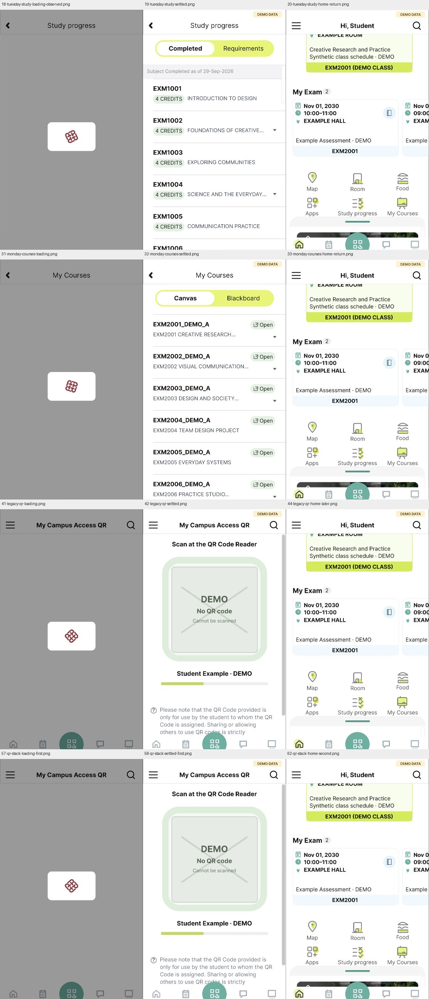

# Study、My Courses、Campus QR 加载及返回 — 2026-10-01

三个已观察原生加载页现已在Figma接入既有Home入口，实际保存加载、DEMO正文及返回截图。当前137映射画板、308配置控件、82次原型运行；完整应用和完整视觉保真仍为 `not_verified`，本批没有新增原生动作或真人评估。

## 实现与依据

Study636:107、Courses636:119、QR636:75为576×970，位置X=0/700/1400、Y=61500，Clip content已读回。最终Courses属性见[检查点截图06](../../evidence/2026-10-01-account-loading-checkpoint/06-courses-outline-source.png)，Study/QR本批再次读回01/04。标题、遮罩和卡片可编辑，校徽为既有原生公开裁片；没有私人正文或有效二维码。初次QR黑色填充和三个源码替换已在[导入检查点](account-loading-work-in-progress.md)保留。

Study/Courses的六个既有Home入口维持Open overlay，加载根After delay800ms Swap overlay进入Completed/Canvas DEMO。QR最终也是Open overlay→加载→800ms Swap overlay→不可扫描DEMO，Home按钮Close overlay恢复既有Home调用者。800ms仅演示参数，原生截图时间间隔不是加载测量；覆盖层是Figma实现，不能推断原生架构。三个加载根均无额外Flow起点。共新增3个延时控件，替换7个入口和1个QR Home出口；当前配置及历史见[连接清单](../../design/polyulife/account-loading-connections.json)。

## 实际回放与失败

- 16–23：Tuesday Home→Study加载18→Completed19→Home20→Courses→Canvas22→Home23。17/21捕获太早仍显示Home，修正文件名及说明；18原先误标正文，已按实际像素改为加载。24–26补录Courses重入可见加载、正文和返回。
- 27–33：Monday Home的两个加载→正文→Back样例，返回原功能视口。
- 34–44：既有静态Home的Study和Courses样例通过导航；QR加载41→DEMO42→Home43/44照片为空，视觉失败保留。
- 45–51：既有Home图片67:917重传同一公开PNG，44/899位置、489×22及STRETCH不变，color-management读回false→true。重载后47有图，QR返回50仍空白；后来保存的51已恢复图，期间没有额外修复。工具当时显示的空白与保存像素不完全一致，以保存图说明结果。重传未证明稳定解决。[属性记录](../../design/polyulife/account-loading-home-image-repair.json)保留前后证据。
- 52–63：保留原配置后将QR改Open/Swap/Close覆盖层，两次连续57–59及60–62均保存加载、正文和有图Home；63复查QR没有自动Flow。修复样例改善，不证明长会话稳定或根因。

24项原型裁片比较13项相等、11项差异：四处左缘局部、四处跨来源全裁片、两处Home缺图与一次稍后恢复。所有bbox和原图保留，未把跨来源差异判为原生缺陷或称逐像素一致。见[截图清单](../../evidence/2026-10-01-account-loading-wired/manifest.json)。

## 未完成范围

本次原生清单仍发现运行项，bundle歧义指向本次Wrapper，绑定读取超时；没有重启或新增成功观察。编辑器导航偶发中断后读取同一活跃tab并重新定位继续，没有重建浏览器。Study/Courses其它项目、滚动边界、加载中提前Back/取消与原生时长待观察；QR的独立起点、其它来源、菜单/搜索及全局导航尚未完成。只验证既有Home来源，不输入凭据、使用有效二维码、修改资料或执行业务提交。私人数据继续合成DEMO，Agent回放不能替代真人课程测试。

来源：[素材台账](../../design/polyulife/account-loading-assets.json)、[生成脚本](../../design/scripts/build_account_loading_svg.py)、[当前观察台账](coverage.json)。
