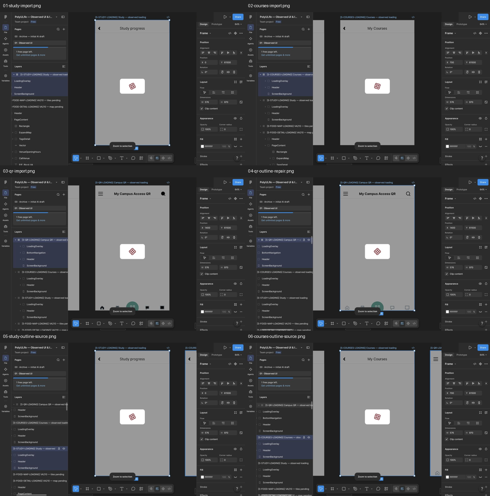

# Study、My Courses 与 Campus QR 加载页检查点

2026-10-01。按用户要求先提交当前进展。三个加载页已通过 Computer Use 导入 Figma，尚未配置本批连接或执行 Present 回放。它们暂不加入 `coverage.json` 的正式画板、控件或运行统计；正式统计仍为134映射画板、305控件、75次原型运行，完整应用为 `not_verified`。

## 素材与导入记录

| 原生状态 / 证据 | 当前 Figma 节点 | SVG |
| --- | --- | --- |
| S-STUDY-LOADING / E-STUDY-LOADING | [636:107](https://www.figma.com/design/ulBuuteCRdzdBsHAaiqyUr/?node-id=636-107) | [Study](../../design/polyulife/study-loading.svg) |
| S-COURSES-LOADING / E-COURSES-LOADING | [636:119](https://www.figma.com/design/ulBuuteCRdzdBsHAaiqyUr/?node-id=636-119) | [Courses](../../design/polyulife/courses-loading.svg) |
| S-QR-LOADING / E-QR-LOADING | [636:75](https://www.figma.com/design/ulBuuteCRdzdBsHAaiqyUr/?node-id=636-75) | [QR](../../design/polyulife/qr-loading.svg) |

设计尺寸576×970，放置位置Y=61500，X依次0/700/1400。初次导入读回尺寸、位置及Clip content；替换后Courses的属性再次读回，Study/QR最终属性仍待独立复查。三个最终加载页和校徽在编辑器截图中可见，不能据此推断Present中的显示稳定性。

页头、灰色遮罩和白色卡片为可编辑图层；校徽取自已有公开原生截图的(258,484,319,543)区域，为61×59静态图片。加载页没有个人课程内容或有效二维码。字体、图标和几何近似，未测量原生加载时长。来源、哈希及生成脚本见[素材台账](../../design/polyulife/account-loading-assets.json)与[生成脚本](../../design/scripts/build_account_loading_svg.py)。本批没有新增原生观察或真人评估。

初版SVG缺少根元素的 `fill="none"`，QR搜索及底部图标出现黑色填充。截图03保留该失败；修正源码并在连线前替换三个导入节点，截图04–06保存修正后的结果。旧节点636:19、636:31、636:43已被替换，不作为当前节点。

[截图清单](../../evidence/2026-10-01-account-loading-checkpoint/manifest.json) · [机器可读接力记录](../../design/polyulife/account-loading-work-in-progress.json)

## 接下来

1. 复查Study与QR最终属性，以及三个根节点是否存在自动创建的Flow。
2. 将既有Study/Courses入口改为打开相应加载覆盖层，以800ms演示延时Swap overlay进入已有DEMO正文；QR沿既有Navigate路径进入加载页及不可扫描的DEMO二维码页。800ms仅为拟定原型参数，不是原生延时测量，也尚未配置。
3. 核对七个既有入口，实际回放三个Home来源及QR既有入口，确认返回栈和图片显示，保留失败截图。
4. 回放和编辑器读回后更新正式台账。加载中提前返回、取消及真实时长尚未验证，不能补造原生行为。
