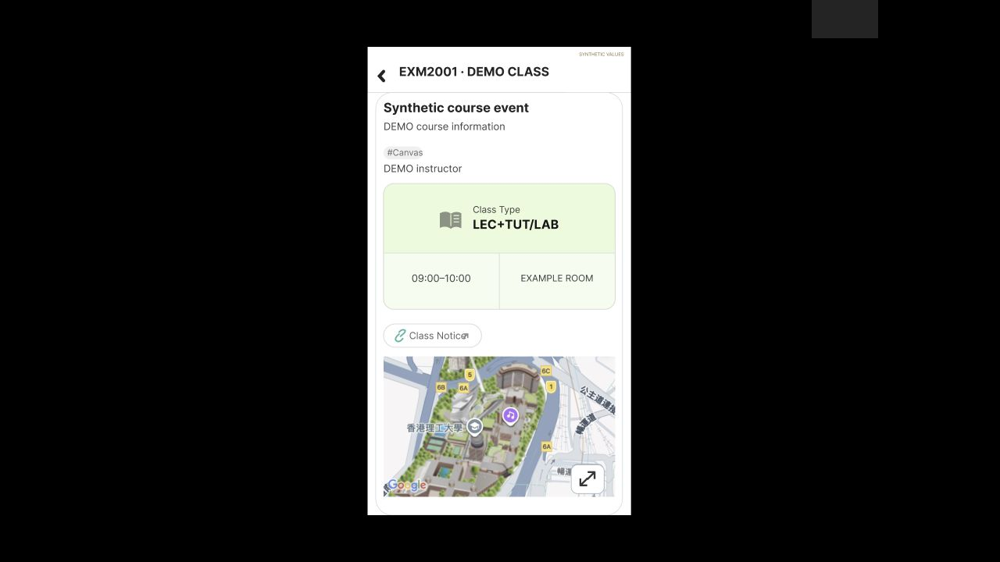

# Oct2 Calendar Class / Exam / Notice — Figma 回放

已将[来源准备](calendar-class-exam-source-preparation.md)中的13份SVG导入现有Figma，配置15条已观察动作对应的连接及1条800ms演示转换，并保存3组有限回放记录。当前为165个映射画板、362个控件、107次原型运行；完整应用仍 `not_verified`。

本批编辑/回放日志在2026-10-02约17:20–17:35 UTC，对应Asia/Shanghai次日凌晨。界面固定October2，私人课程资料全部为合成DEMO；不是实时课程数据或新的原生观察。用户通知已解锁后，安装路径连接超时；从本次运行清单及bundle歧义结果重新发现的Wrapper路径也返回AppleEvent超时，未取得实际原生窗口。因此Payment Apply结果仍未知，本批没有新增原生动作。

## 导入和连接

13个Frame均576×1024，位置/尺寸已在实际编辑器读回。节点及原生来源见[来源清单](../../design/polyulife/calendar-oct2-class-exam-sources.json)，实际控件节点、配置读回和原型记录见[连接清单](../../design/polyulife/calendar-oct2-class-exam-connections.json)。1024为本次Mac全屏样例按576宽归一化的尺寸，未验收iPhone视口保真。

| 状态 | Figma节点 |
| --- | --- |
| Class草稿，应用背景None | 800:19 |
| 已应用Class | 800:206 |
| 课程详情 | 800:365 |
| Notice加载 | 800:403 |
| Notice观察到的空白 | 800:438 |
| Notice菜单 | 800:471 |
| Class草稿，应用背景Class | 800:520 |
| None草稿，应用背景Class | 800:706 |
| Exam草稿，应用背景Class | 800:891 |
| 已应用Exam，这个日期空状态 | 800:1077 |
| Exam草稿，应用背景Exam | 800:1237 |
| None草稿，应用背景Exam | 800:1424 |
| Payment草稿，应用背景Exam | 800:1610 |

入口由既有None重开画板791:873的Class控件接入。已连接Class草稿→Apply→Class卡片省略号→详情→Class Notice→加载→空白→More→菜单→Cancel→空白→X→详情→Back→Class。后续Class筛选取消Class→勾Exam→Apply→Exam空状态→重开取消Exam→勾Payment，停在Payment草稿。

15条点击均On click / Navigate to / Instant，逐一对应A-NATIVE-OCT2-11、12、13、14、16–26的实际来源上下文。加载到空白是After delay 800ms演示，不是实测原生时延，也不证明网页成功加载。整帧Navigate只是有限参考原型的实现，未据此推断原生页面栈、任意筛选组合或持久化规则。

原独立入口已改为 **Reference · Oct2 Calendar filters & Notice — partial**，说明更新为18个有限参考画板。[从入口回放](https://www.figma.com/proto/ulBuuteCRdzdBsHAaiqyUr/PolyULife-%E2%80%94-Observed-UI---Interaction-Atlas?node-id=791-177&scaling=scale-down&content-scaling=fixed&starting-point-node-id=791%3A177)。既有None批次的两个推广X出口仍按推断标注；本批没有补造未观察的X结果。

## 实际回放、异常与恢复

[公开截图清单](../../evidence/2026-10-03-calendar-class-exam-prototype/manifest.json)包含25张实际Present截图、2张编辑器截图及[总览](../../evidence/2026-10-03-calendar-class-exam-prototype/contact-sheet.png)。SDK保存的截图逐格复查；快速批量截图00–05的像素确实显示预期状态。AX/URL更新曾稍滞后于画面，不能以单次中间URL推翻已保存像素，也不能单靠预期节点声称通过。

- 00–12：All→None Apply→重开→Class Apply→详情→Notice空白/菜单→取消→X。首次返回详情11和保存截图12均缺少地图，保留失败。
- 13–17：重载Present并通过Figma Image对话框的文件选择器重传校园地图PNG后，详情地图恢复；再次进入Notice保存14加载标识、15空白，X返回16地图可见，Back恢复17 Class。
- 17–24：Class草稿清空→Exam草稿→Apply空状态→重开→清空Exam→Payment草稿。这个日期No event不代表所有日期无考试。

缺图期间CUA即时截图曾显示全黑，但同阶段SDK实际保存的12仍是缺图详情；文件名保留当时标签，manifest明确纠正其像素内容。没有把未保存的全黑即时画面伪称成归档图片。重载与重传都执行过，无法分离各自对恢复的因果贡献，未宣称彻底解决浏览器渲染问题。

应用裁片 `[470,60,808,661]` 的6次重复状态比较中，5次相等：菜单取消恢复空白、重复空白、恢复后的重复详情、Back恢复Class、两次缺图详情。1次不等是首张详情与首次缺图返回，差异区域含地图和卡片底部。相等的缺图截图仍是失败，不被计为视觉通过。这些比较仅验证原型重复状态，不是原生像素保真或真人测试。

## 保留的未完成范围

主Home/More调用者、日期/月份及模式保留尚未整合到这组固定日期参考流程。Payment Apply没有结果画板或连接；其他筛选组合与未观察草稿X出口、地图缩放/手势/全屏、Notice Reload、系统浏览器、分享、复制仍待补查。校园地理与加载标识是截图裁片，其余文字/矢量可编辑；字体、图标、几何为近似。实际手机触控及完整应用验收、真人Maze评估均未完成。
