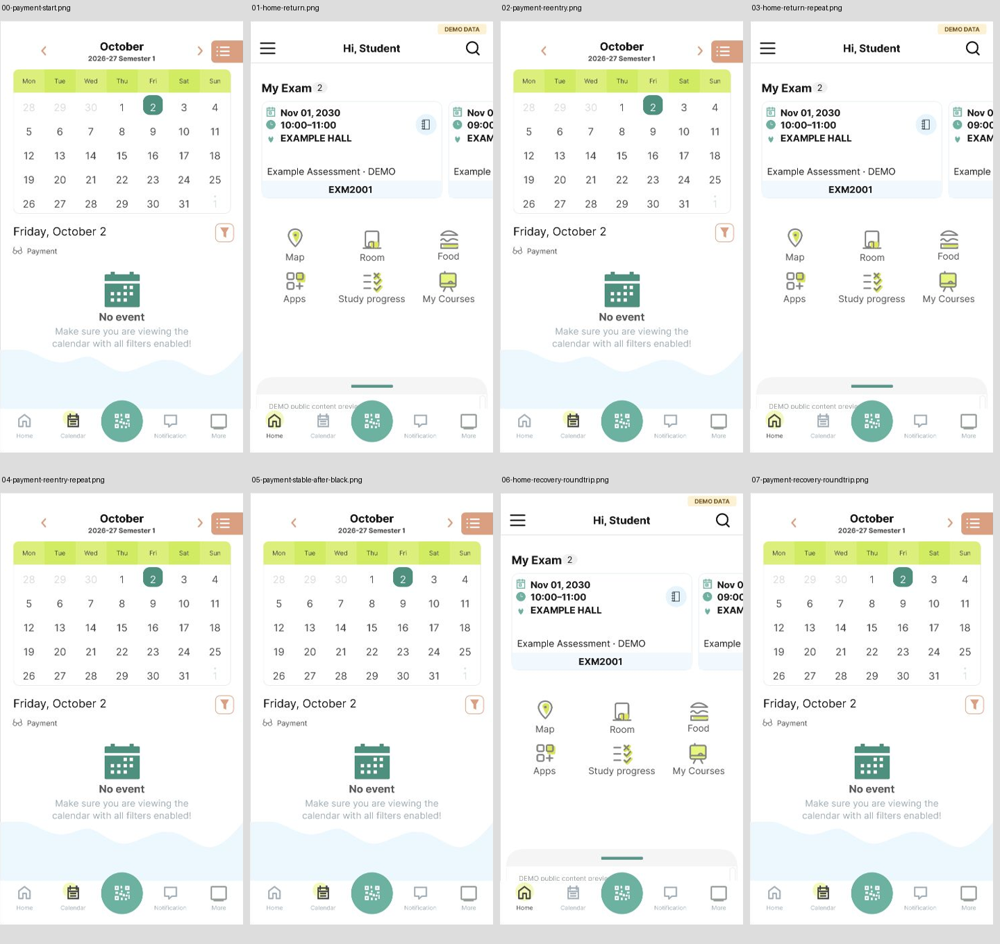

# Payment/Home 有限调用上下文原型（2026-10-03）

基于[本次原生往返](calendar-payment-oct3-walkthrough.md)，新建可编辑的 Home DEMO 画板，将 **Payment → Home → Calendar Payment** 接到 October2/3 参考分支。这是一个保留日期和分类的有限上下文；其它既有 Home/More 入口与一般持久化规则尚未整合。完整应用仍 `not_verified`。

## 连接与内容

| 已观察原生动作 | Figma 连接 | 依据 |
| --- | --- | --- |
| A-NATIVE-OCT3-PAYMENT-HOME | Payment 823:21 / NavHome 823:160 → Home 825:19 | E-NATIVE-OCT3-PAYMENT-06 / 安全AX |
| A-NATIVE-OCT3-HOME-CALENDAR | Home 825:19 / NavCalendar 825:126 → Payment 823:21 | E-NATIVE-OCT3-PAYMENT-07 / 安全AX |

两条连接为 On click / Navigate to / Instant。[实际属性读回](../../design/polyulife/calendar-oct3-payment-home-connections.json)，[画板与来源](../../design/polyulife/calendar-oct3-payment-home-sources.json)，[可编辑SVG](../../design/polyulife/calendar-oct3-payment-home-demo.svg)。Home 576×1024、文本/图形/导航分组可编辑；问候、考试数量、课程代码、考试日期/时间/地点和底部预览全部是合成 DEMO。观察截图已遮盖这些私人字段，没有上传真实身份或考试值。

Home 是这个已观察滚动位置的静态样本。其它入口、课程卡片与滚动没有在新画板连接，不宣称完整首页可交互。公共图标与位置近似，完整视觉验收仍待完成。固定连接表达这个已观察返回上下文，不模拟任意状态保存。

## 实际 Present 回放

[公开清单](../../evidence/2026-10-03-calendar-payment-home-prototype/manifest.json)保存8张实际Present截图、1张编辑器范围说明与一张拼图，分为3组运行：

1. 00 Payment → 01 Home → 02 Payment：目标均实际可见。
2. 02 Payment → 03 Home → 04第二次Calendar点击后的保存图为黑色。此时AX URL仍显示前一Home；不能给04指定可见画板。随后没有新增输入，截图恢复Payment，05保存了稳定画面。这个采集失败保留，原因未分离，不归为原生App黑屏。
3. 从05重新执行 → 06 Home → 07 Payment：目标再次可见，作为独立恢复样例；不推导长期稳定性。

5项有效重复状态裁片比较全部相等；黑图04不参与通过比较。对应结果见清单。比较只验证固定原型样本，不能证明原生像素保真或真人成功率。参考分支范围说明现为20个有限画板、26个控件；没有新增独立Flow。

当前Figma167映射画板、365配置控件、112次运行（含失败）；原生仍157状态/303动作。下一步补Payment重开/X、其它日期/筛选组合与模式边界、不同Home/More调用者，以及新Home的剩余控件。公开图/AX/代码不包含个人记录；真人课程测试仍须单独完成。
