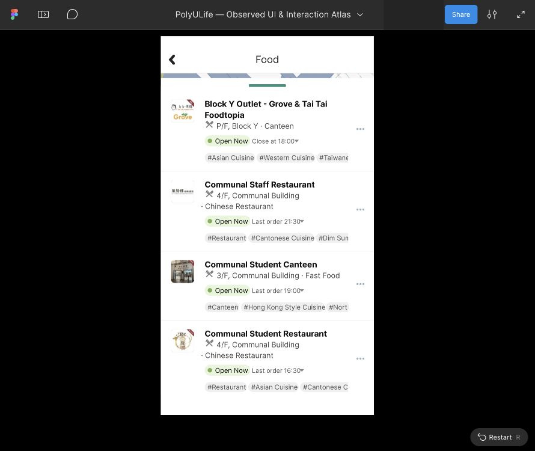

# Food列表底部白色区域复核与修正

本批从营业时间展开截图复核发现：[此前连续列表](food-oct3-full-list-walkthrough.md)把最后画面分隔线以下73px全部放入滚动内容，不能解释中段/顶部画面也存在的底部空白。八张已归档原生截图06、07、08、13、14、17、19、21在 `(0,970,576,1024)` 均为精确纯白。没有新增原生动作，本次连接仍报告Mac锁定。

观察事实是这些样本的底部54px始终纯白；不能仅凭字形最后一行反推原生视口边界。最初肉眼按y=954估计，像素检查发现其下仍有内容，已撤回该精确边界判断。当前复现让已确认的54px留白位于滚动视口外，但原生的完整几何边界仍未知。

## 实际Figma修正

在原根954:3580中，将内容背景高度5635改为5581，视口954:3588高度877改为823；位置0/147、宽576、Clip content和Vertical保持。内容组954:3589实际复核0/0、576×5581、Left/Top，行没有缩放。此前73px末尾像素区域在原型中拆为19px内容尾部与54px视口外空白；19px是构造选择，不是测得的原生完整内容范围。推算滚动范围仍4758px，整列表行高近似。

旧源稿冻结为[修正前来源](../../design/polyulife/food-oct3-full-list-pre-bottom-region.svg)，旧映射在coverage的reconstruction_versions保留；此前所有截图、原生执行与回放记录保持。当前源稿补入固定白色区域的向量表达，来源是实际UI几何记录，不是Figma导出。

[独立Food列表参考入口](https://www.figma.com/proto/ulBuuteCRdzdBsHAaiqyUr/PolyULife-%E2%80%94-Observed-UI-and-Interaction-Atlas?node-id=954-3580&scaling=min-zoom&content-scaling=fixed&starting-point-node-id=954%3A3580&show-proto-sidebar=1)已通过实际UI创建并回放。名称为 `Reference · Food 28 venues — continuous list`，说明中写明近似范围、旧尾部判断的修正及未配置导航。

## 回放与限制

保存16张编辑器/Present截图。首次Actual size/侧栏裁切保留，关闭侧栏并选择Fit width and height后，回放顶部→中段→较低位置→最后Gourmet→额外下滚→反向顶部→重复末端→重复顶部。四项原始应用裁片267/60/623/691比较全部相等。

八项原型底部内部裁片270/660/620/688与均匀纯白比较均有小块差异，保存差异边界，未缩小裁片掩盖失败。边缘、截图编码或渲染的原因尚未隔离。因此不能称原型底部逐像素匹配原生白色区域，完整保真仍未通过。原生八张既有PNG的54px区域则确实全为纯白，这两个检查分开记录。

- [16张截图与联系表](../../evidence/2026-10-03-food-bottom-region/manifest.json)
- [原生像素复查、几何与失败比较](../../evidence/2026-10-03-food-bottom-region/readback.json)
- [当前布局与来源](../../design/polyulife/food-oct3-full-list-local-layout.json)
- [覆盖台账](coverage.json)

当前204映射画板、436控件、19滚动区域、141次运行，2746证据、68份清单含2466PNG；原生27会话、212状态、395动作保持。没有接Home调用者、Back、详情、时间展开、标签或订餐导航，也未重试此前被拒绝的Action下拉框。

本轮营业时间源稿尚未制作；先修正了会影响这些状态的列表区域。后续继续Block Y、Open H Café、红色品牌VA210及Closed Gourmet的展开状态，H Café/U Garden的Online Order行省略号位置也需按额外行高对齐。完整应用、精确几何和真人评估保持未完成。
