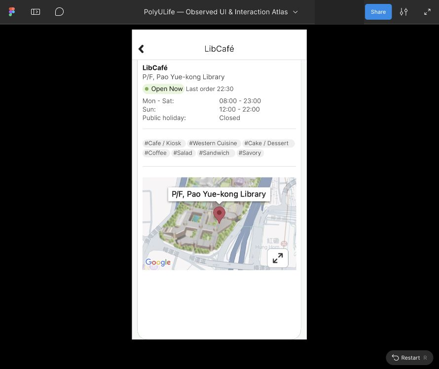

# Food 详情参考、LibCafé 修正与 Block Y 较低视口

2026-10-03，沿用已保存的原生会话与公开截图，通过 Computer Use 修改实际 Figma 并保存40张编辑器/Present采样。此批没有新原生会话、状态或动作；用户报告解锁后，实际窗口读取仍返回Mac锁定。原生事实、Figma参考显示和真人评估分别记录。

## 实际改动与参考入口

| 原生历史状态 | 实际 Figma 根 | 本批结果 |
| --- | --- | --- |
| LibCafé详情，Coffee调用者 | 949:248 | 原根保留，卡片、外背景和内嵌地图高度修正；独立显示并重开 |
| Block Y展开图片 | 949:193 | 图片Image填充与308×261尺寸检查；独立显示并重开 |
| Coffee查询 | 949:201 | 固定8条结果；查询与完整Block Y结果分别检查独立Text |
| Sandwich查询 | 949:319 | 固定8条结果；查询与完整Block Y结果分别检查独立Text |
| Block Y顶部/较低位置 | 949:63 | 既有有限垂直滚动再次回放，较低状态复用同一画板 |

真实复制的五个参考链接、描述及对应证据见[参考记录](../../design/polyulife/food-oct3-detail-references.json)。它们仅是独立参考入口；调用者、结果详情、Back、关闭图片、标签和地图展开的导航仍未配置，也不支持任意查询或实时地图。

LibCafé旧卡片Vector949:253为18,100、539×1013，底边在画板外。本批以小SVG替换该子图层，得到Frame1023:19，修正粘贴保留中心造成的Y144.5为100，最终18,100、539×924且Clip content关闭。外背景Vector949:249由白色改为原生样本外侧颜色F7F9F6；内嵌地图Image949:298保持35,488、宽507，高309改为307，匹配历史素材裁片。标题Text949:254仍为Inter Bold22px。底角半径38及卡片边界来自可见样本近似，精确原生几何尚未知。

[修正源稿](../../design/polyulife/food-oct3-libcafe-card-corrected.svg)只记录上述三处结构差异，不是Figma导出。原始SVG、所有既有素材和历史导入记录保留。Coffee/Sandwich查询Text均X76/Y135、Inter Regular23px，完整Block Y结果Text为X30/Y692、Inter Regular23px；这些是Figma属性，不证明原生字体精确一致。

## 既有滚动与较低状态

Block Y根949:63、视口949:65（0,100、576×924）、内容949:66（高992）保持；推断的68px范围可到达地图完整可见的较低视口。`S-FOOD-OCT3-BLOCKY-LOWER`关联到同一根与现有滚动区域；旧949:128静态较低稿保留作历史参考，不新增重复正式画板。原生E-FOOD-MENU-10/E-FOOD-MENU-15只支持已观察样本，完整原生滚动边界及返回规则仍未知。

回放步骤34–39依次为初始显示、向上稳定顶部、向下较低、额外向下、反向顶部、额外向上。只有36的向下采样关联已有原生动作A-FOOD-OCT3-MENU-DETAIL-SCROLL，其余为原型核对。没有新增连接或滚动区域。

## 验证与保留的失败

40张实际截图转换为真正RGB PNG并遮盖协作者身份，另有联系表；[清单](../../evidence/2026-10-03-food-detail-references/manifest.json)记录哈希、尺寸和时间，[读回记录](../../evidence/2026-10-03-food-detail-references/readback.json)保存属性、输入和比较。16项裁片比较13项相等、3项不等：

- 四项独立参考首次/重开全等；顶部反向恢复、额外上下滚动三项全等。
- 初始34与稳定顶部35不同，原因未隔离，不计通过。
- 四项较宽标题区域比较有两项不同，差异落在其底部10px；失败保留。另单独比较可见标题/返回区域四项全等，不替代前述失败。

三次紧接属性编辑的根导航中断保留。语义侧栏行未成功选根，根一度隐藏；05、06、07虽含预期成功命名，实际均为失败。Show复选框定位没有匹配；第一次图标坐标406无恢复，按新截图417才恢复，08确认可见。问题原因未独立隔离，不归因于PolyULife。后续只通过画布Select layer选择Frame完成设计检查。

当前正式217映射画板、436配置控件、19滚动区域、157次运行；6个导入草稿仍未正式映射，包括历史较低稿和四种营业时间稿。原生27会话、212状态、395动作保持。2899条证据、73份公开清单；公开目录2614张PNG，清单索引2612张（两张旧图未索引）。数量不是覆盖率，完整应用及视觉保真保持`not_verified`。

此前Action下拉框导航配置被URL协议安全审核拒绝，本批未重试或绕过。普通设计修正、独立起点和既有滚动回放属于不同操作；未提交预约、订餐、资料变更或系统设置。

