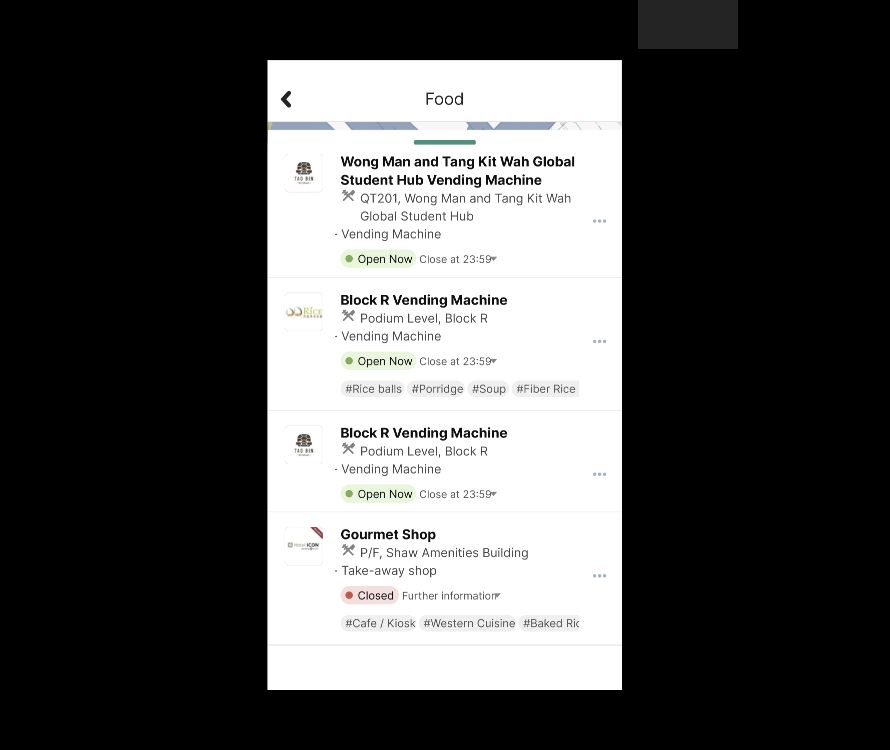

# Food 当前28条连续列表复现

本批依照[原生反向走查](food-oct3-reverse-walkthrough.md)的28条公开场所目录，在实际 Figma 编辑器中重建并回放连续列表。未新增原生采样。当前正式统计为203映射画板、436控件、18滚动区域、139次运行；原生27会话、212状态、395动作保持，完整应用与视觉保真仍为 `not_verified`。

[设计画板954:3580](https://www.figma.com/design/ulBuuteCRdzdBsHAaiqyUr/?node-id=954-3580)位于 `01 · Observed UI`，576×1024，画布位置0/94000。实际 Present 从首条 Block Y 连续滚至末条 Closed Gourmet Shop；五条 VA210 和两条 Block R 按公共品牌图标、标签及研究行号分别保留，不推断后台业务身份。

## 源稿、导入失败与修正

[生成器](../../design/scripts/build_food_oct3_full_list.py)从既有公开截图裁出26张品牌图标与14px地图条；H/L头像、标题、地址、营业状态、标签及控件为独立 SVG 文字/向量。Row01 标题在实际编辑器中读取为独立 Text、Inter Bold22px；其它子层未逐一验证编辑能力，字体、图标及间距仍近似。

前三次导入均出现巨大内容组。逐行读取定位到 H Café / U Garden 的 Online Order 路径：生成器的 SVG C 命令缺少数字分隔符，拼出巨大坐标。行内坐标和显式 clip 单位单独未修复问题；补分隔符后，内容组实际读取576×5562。此为源稿生成错误，没有据此认定 Figma 或原生 App 缺陷。[失败源稿](../../design/polyulife/food-oct3-full-list-layout.json)和00–04截图保留；被替换的三个旧根不计正式画板或未配置草稿。

VenueListViewport954:3588 转为 Frame，位置0/147，576×877、Clip content开启、Overflow Vertical。内容组954:3589使用Left/Top约束，固定 Header、地图条和面板把手在滚动视口外。当前24行标签保留可见前缀和右侧裁切；AX中的离屏标签名称不证明水平手势可用。Online Order只是可见控件。

## 底部留白修正与实际回放

首次连续回放保存00–28编辑器/Present截图，所有28条标题和品牌均在前向滚动样本中可见。随后复核原生17/18底部证据发现最后分隔线下还有73px尾部，其中首1px为分隔线抗锯齿，余72px纯白。当前列表缺少这段尾部，旧源稿冻结为[无尾部历史源稿](../../design/polyulife/food-oct3-full-list-local-no-footer.svg)。

实际编辑器只将 ListContentBackground954:3590 高度5562改为5635，未缩放行组。实际内容组保持0/0、576×5635、Left/Top；视口保持576×877，推算滚动范围4758px。73px来自观察到的尾部，但整列表行高和完整原生几何仍未精确测定。

修正后保存29–36八张实际截图，进行顶部→底部→额外下滚→反向顶部→重复底部→重复顶部回放。原始应用裁片267/60/623/691四项比较全部相等。此前无尾部版本六项边界/反向比较也相等，保留为历史运行；其14项固定区域比较10等、4不等，差异落在选定裁片底部8px内，原因未隔离，没有缩小裁片或隐藏失败。

- [37张实际截图清单](../../evidence/2026-10-03-food-full-list/manifest.json)
- [初始失败、几何、文字与比较记录](../../evidence/2026-10-03-food-full-list/readback.json)
- [尾部修正与四项重复比较](../../evidence/2026-10-03-food-full-list/footer-readback.json)
- [当前源稿与布局](../../design/polyulife/food-oct3-full-list-local-layout.json)
- [覆盖台账](coverage.json)

本批为独立展开列表，未接 Home 调用者、面板收起、Back、场所详情、营业时间、菜单、标签或订餐导航。16个既有草稿保持未配置，未增加连接。此前 Action 下拉框的浏览器安全拒绝未重试或绕过；本批只执行不同的布局、滚动配置和回放操作。公开截图遮盖协作者身份；本地原始截图被 Git 忽略。有限原型回放和文件校验不能替代原生触控验证或真人 Maze 评估。
