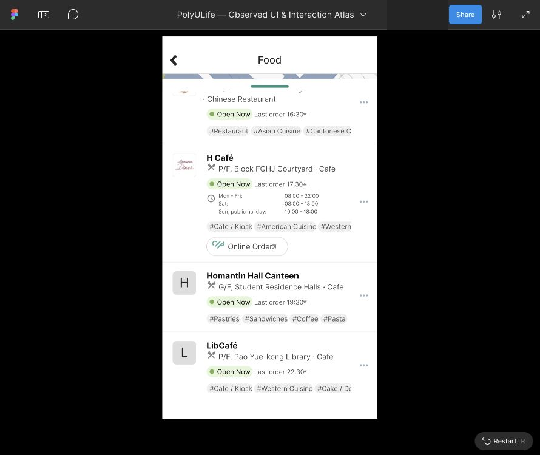

# Food：营业时间展开参考显示

2026-10-03，通过Computer Use为四张既有营业时间展开画板建立独立参考入口，每张在实际Present显示和重开一次。保存20张实际编辑器/Present采样及联系表；没有新原生会话、状态或动作。原生连接复查仍提示Mac锁定。完整应用和视觉保真保持`not_verified`。

| 已归档原生状态 | 实际Figma根 | 此次显示的历史营业时间 |
| --- | --- | --- |
| Block Y，E-FOOD-REV-04 | 967:19 | Mon–Fri08:00–20:00；Sat09:00–18:00；Sun/public holiday Closed |
| Open H Café，E-FOOD-REV-08 | 967:178 | Mon–Fri08:00–22:00；Sat08:00–18:00；Sun/public holiday10:00–18:00 |
| 指定红色VA210、Chinese Soup标签，E-FOOD-REV-14 | 967:382 | Mon–Sun/public holiday00:00–23:59；不推广到同名其它机器 |
| Closed Gourmet，E-FOOD-REV-19 | 967:741 | Mon–Fri08:00–19:30；Sat–Sun/public holiday Closed |

真实复制的四个参考链接、描述、文字节点及来源哈希见[参考记录](../../design/polyulife/food-oct3-hours-references.json)。四张根均576×1024、X0/700/1400/2100、Y100000；每张分别检查一个独立时间Text，Inter Regular14px、X328。地图及公共品牌图像保持栅格，在这些采样中显示正常，无需重传；旧源稿、素材、导入记录和Gourmet间距修正历史均保持。

这些是固定历史视口，Open/Closed及时间不表示当前实时状态。954px等内容遮罩不证明原生滚动边界。未新增营业时间展开/收起、Home/Back调用者、菜单/详情/标签/查询/订餐/地图导航或滚动区域。参考入口不是完整原生业务流程，字体与精确几何仍未知。

四组首次/重开应用区域裁片（267,60至623,691）均相等。最后一次工具预览显示黑色，但保存文件是名为.png的JPEG，解码后为正常浅色Gourmet页面且与首次裁片一致。公开版转换为真正RGB PNG；预览差异原因未隔离，不据此报告Figma黑屏。

[公开清单](../../evidence/2026-10-03-food-hours-references/manifest.json)记录20张截图及联系表的尺寸、哈希和时间；[读回记录](../../evidence/2026-10-03-food-hours-references/readback.json)保存根/文字属性、起点、实际链接、比较及预览冲突。协作者身份已遮盖，原始截图仍在忽略目录。

当前正式221映射画板、436配置控件、19滚动区域、161次运行；仅余两个未正式映射的导入草稿：Notification地图加载946:19，以及已由现有滚动状态关联的历史Block Y较低稿949:128。原生27会话、212状态、395动作保持。2921条证据、74份公开清单；公开目录2635张PNG，清单索引2633张（两张旧图未索引）。这些数量不代表覆盖率，真人Maze测试另行完成。

此前Action下拉框导航配置被自动安全审核以URL协议安全为由拒绝；本批未重试或绕过。布局/属性检查、独立参考起点与实际显示属于不同操作。本批未提交业务、修改系统设置或退出登录。

