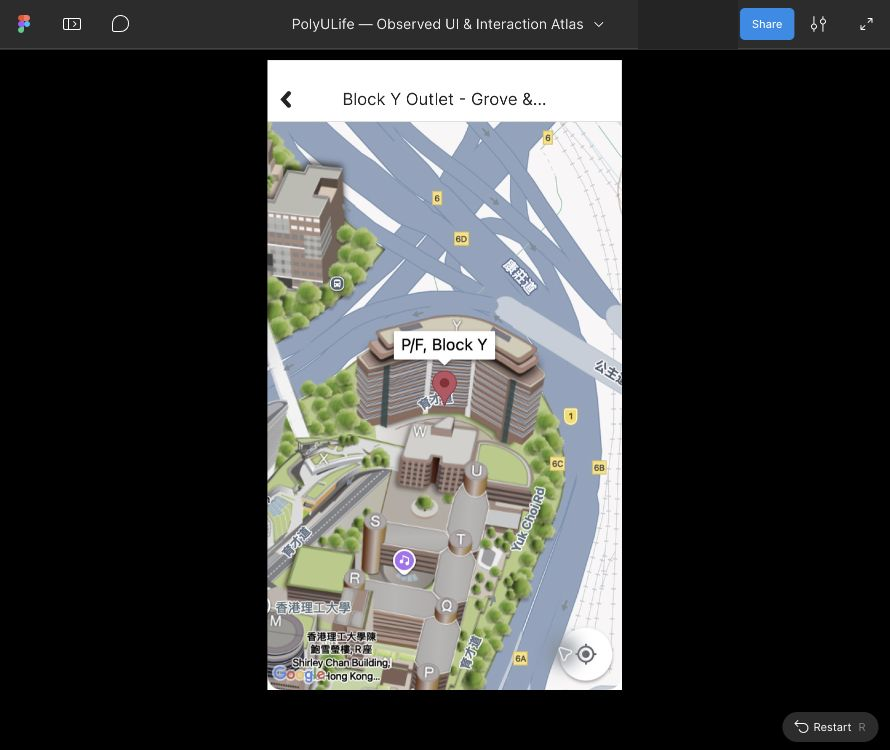

# Food 地图与加载状态独立参考

2026-10-03。五张已导入的地图/加载草稿增加独立参考起点，并各自实际显示、重开一次。检查了根尺寸、独立标题Text和图片填充；本批没有新增原生动作，没有连接地图调用者、Back、缩放或加载完成转移。

目前213映射画板、436配置控件、19滚动区域、152次运行，10个已导入草稿仍未映射；完整应用、导航与视觉保真仍 `not_verified`。新增五项映射仅代表独立有限状态参考，不代表五条业务流程完成。

## 来源和实际属性

来源是 [Food详情原生走查](food-oct3-detail-walkthrough.md) 中的公开校园地图截图。原有SVG和素材字节不变，实际图层记录及复制的独立入口链接见 [food-oct3-map-references.json](../../design/polyulife/food-oct3-map-references.json)。

| 状态 | 原生证据 | 实际Figma根 | 画布位置 |
| --- | --- | --- | --- |
| LibCafé地图 | E-FOOD-MENU-06 | [949:308](https://www.figma.com/design/ulBuuteCRdzdBsHAaiqyUr/?node-id=949-308) | 3500,88000 |
| Block Y初始地图 | E-FOOD-MENU-12 | [949:378](https://www.figma.com/design/ulBuuteCRdzdBsHAaiqyUr/?node-id=949-378) | 1400,90000 |
| Block Y放大样本 | E-FOOD-MENU-13 | [949:389](https://www.figma.com/design/ulBuuteCRdzdBsHAaiqyUr/?node-id=949-389) | 2100,90000 |
| Block Y缩小样本 | E-FOOD-MENU-14 | [949:400](https://www.figma.com/design/ulBuuteCRdzdBsHAaiqyUr/?node-id=949-400) | 2800,90000 |
| Block Y地图加载 | E-FOOD-MENU-11 | [949:366](https://www.figma.com/design/ulBuuteCRdzdBsHAaiqyUr/?node-id=949-366) | 700,90000 |

五个根均576×1024。独立Header标题分别选择并确认Inter Regular27px；LibCafé标题X238.5/Y47、99×33，四个Block Y标题X122/Y47、332×33。字体及截断宽度是重建近似，不声明准确原生保真。

四个地图的独立Image Rectangle实际为X0/Y100、576×924；加载校徽Image为X265/Y100、50×51。图片在本批编辑器及Present样本中正常显示，无需重传。地图地理信息、标注、定位按钮外观及Google归属信息均来自栅格裁片；标题可编辑，但栅格中的标签/控件不是独立交互对象。截图鼠标痕迹保留为来源限制。

## 有限显示与重开检查

30张实际编辑器/Present截图与联系表见 [公开清单](../../evidence/2026-10-03-food-map-reference/manifest.json)。[readback](../../evidence/2026-10-03-food-map-reference/readback.json) 保存属性、独立入口、操作时间和五项重复裁片比较。每个入口命名为 `Reference · … — archived viewport`，描述明确指出不实现原生旅程。

五个参考均由实际复制链接独立打开，关闭流程侧栏并设置Fit width and height；然后依次再打开一遍。五组应用裁片 `(267,60,623,691)` 全部相等。保存文件分别显示LibCafé图书馆标注、Block Y三种不同地图样本及加载校徽。该比较只验证固定参考的有限重开显示，不证明原生重新进入、缩放状态保留或未来素材稳定性。

最后一次工具预览显示黑色。核对保存文件后，发现其为JPEG字节但使用.png文件名；加载正文中心像素为242/242/242，应用裁片平均值约241，并与首次加载样本相等。转换为真实RGB PNG并遮盖协作者身份后，实际公开预览正常。差异原因未隔离，没有据此认定Figma黑屏、图片丢失或原生地图异常。

## 未完成项与接力

- 五个独立参考之间没有导航连接，也没有加载完成延时。原生曾观察一对AX Slider Increment/Decrement，当前参考不实现该输入或缩放边界。
- 地图打开、返回详情调用者、自由平移、定位、连续缩放及实时地图均未配置或验证。显示定位按钮不表示定位功能可用。
- 当前真实原生窗口读取仍返回Mac锁定；没有新增原生会话、状态、动作或业务操作。原生保持27会话、212状态、395动作。
- 先前Action导航下拉框操作被URL协议安全审核拒绝，未重试或绕过；本批独立参考起点和属性检查是不同操作，不补足被拒绝的导航连接。

原始导入台账与所有旧映射、运行、连接、滚动区保持。原生观察、Figma有限参考显示及真人评估严格分开，图片/画板/运行数量不代表完整覆盖率。剩余工作以 [coverage.json](coverage.json) 和 [详情计划](../../design/polyulife/food-oct3-detail-plan.json) 为准。

