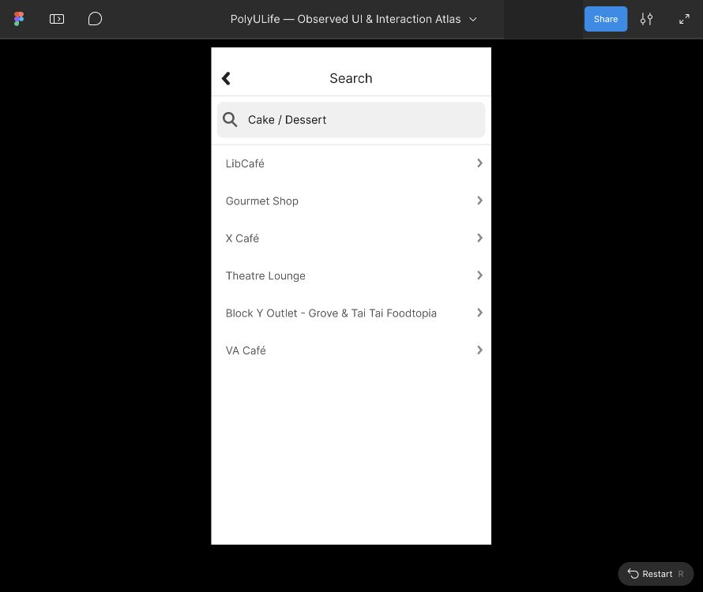

# Food 五项查询参考与搜索栏位置修正

2026-10-03。五张既有查询 Frame 的文字起点及放大镜位置已通过实际 Figma UI 修正；Asian、Taiwanese、Cake / Dessert、Salad 增加独立参考入口并分别在 Present 查看。Western 保留既有有限滚动参考，修正搜索栏后再次回放。它们使用已归档的原生数据，没有执行新的原生查询。

完整应用、完整导航和视觉保真仍为 `not_verified`。目前208映射画板、436配置控件、19滚动区域、147次运行；15个导入草稿仍未映射。新增四个映射是独立固定结果参考，不代表四条完整交互链完成。

## 原生依据与实际修改

使用 [余下五项标签原生记录](food-oct3-remaining-tags-walkthrough.md) 的稳定样本：E-FOOD-TAGS-14/16/18/20/22，以及 Western 较低位置 E-FOOD-TAGS-04。结果数量和公开名称来自这些样本；完整搜索索引、实时营业状态及原生准确字体/几何仍未知。

| 查询 | 实际根节点 | 结果数 | 本次显示范围 |
| --- | --- | --- | --- |
| Asian Cuisine | [954:19](https://www.figma.com/design/ulBuuteCRdzdBsHAaiqyUr/?node-id=954-19) | 6 | 独立固定结果参考 |
| Western Cuisine | [954:59](https://www.figma.com/design/ulBuuteCRdzdBsHAaiqyUr/?node-id=954-59) | 11 | 既有有限垂直滚动参考 |
| Taiwanese Cuisine | [954:119](https://www.figma.com/design/ulBuuteCRdzdBsHAaiqyUr/?node-id=954-119) | 1 | 独立固定结果参考 |
| Cake / Dessert | [954:139](https://www.figma.com/design/ulBuuteCRdzdBsHAaiqyUr/?node-id=954-139) | 6 | 独立固定结果参考 |
| Salad | [954:179](https://www.figma.com/design/ulBuuteCRdzdBsHAaiqyUr/?node-id=954-179) | 7 | 独立固定结果参考 |

五个根576×1024保持；位置为X0/700/1400/2100/2800、Y92000。实际选中查询 Text 的X58→76、Y135保持，Inter Regular23px；圆形向量X22→26、20×20保持，手柄X40→44、9×9保持。共15个子图层位置修改，结果行未移动。每张稿独立选择一条完整 Block Y 场所标题，实际属性读回为 Inter Regular22px；其它所有行没有逐项检查编辑性。

原始五张标签SVG与 [Western旧滚动源稿](../../design/polyulife/food-oct3-western-scroll.svg) 字节保持。五份新SVG只改变SearchInput的三个属性；恢复这三个属性后，XML与原树完全相等。新文件是对实际UI修改的结构记录，不能当作Figma导出或原生逐像素保真证明。

## 实际参考显示与有限回放

43张真实编辑器/Present采样以及联系表见 [公开清单](../../evidence/2026-10-03-food-query-alignment/manifest.json)，操作、属性、独立入口链接和比较见 [readback](../../evidence/2026-10-03-food-query-alignment/readback.json)。新源稿与实际入口汇总见 [来源元数据](../../design/polyulife/food-oct3-query-alignment-sources.json)；生成脚本见 [build_food_oct3_query_alignment.py](../../design/scripts/build_food_oct3_query_alignment.py)。

Asian首先按复制链接打开为Actual size且显示流程侧栏，下方被裁切；原始07样本保留。改为Fit width and height后，08确认六条公开结果全部可见。Salad、Taiwanese、Cake分别显示7/1/6条结果。四个新入口命名为 `Reference · 查询名 — observed results`，描述明确指出固定数据及未配置项。没有新增查询输入、结果详情、Back或标签调用者连接，也没有新增滚动区域。

Western沿用 `Reference · Western Cuisine — finite results scroll`；根无滚动，既有子视口957:20为576×824、内容957:19为540×840，推算范围23px。29→30向下、31额外向下、32反向和33额外向上保存为一次有限运行。三个完整应用裁片比较和四个固定标题/搜索栏裁片比较全部相等。这仅验证该固定原型重复显示及搜索栏固定，不确立原生完整滚动边界。

五次新增运行分别记录独立显示或既有有限滚动。原始导入记录、旧Western映射源稿和所有既有运行保留；Western旧映射另存历史版本，当前映射指向新对齐源稿。

## 保留的失败及限制

- Asian修正手柄后，根节点导航一次ERR_ABORTED；检查当时叶节点状态后重试同一已知根，成功画面和恢复说明保留。
- Salad较短的查询文字不覆盖先前长查询的点击点，菜单没有Text目标；两次Escape后，一次辅助选择仍未找到Select layer。重新看图，在文字内部定位才选中Text Salad，确认正确单层后才修改X。13目标失败截图保留。
- Asian初始Present裁切保留，没有计作六条结果的成功显示。
- 用户回复解锁后，本次真实原生读取仍返回Mac locked。原生保持27会话、212状态、395动作（308 observed、78 not_attempted、9 attempted_unverified）；没有新增原生状态、业务提交或系统配置。
- 此前Action下拉框操作被URL协议安全审核拒绝，未重试或绕过。本批独立参考起点、布局及滚动操作属于不同操作；没有补上被拒绝的导航连接。

公开截图遮盖Figma协作者身份；内容仅为公开查询和场所名称。原始截图仍在被忽略的raw目录。原生观察、Figma参考显示与真人测试保持分开；这些数量不能作为全应用覆盖率或课程真人评估结果。

