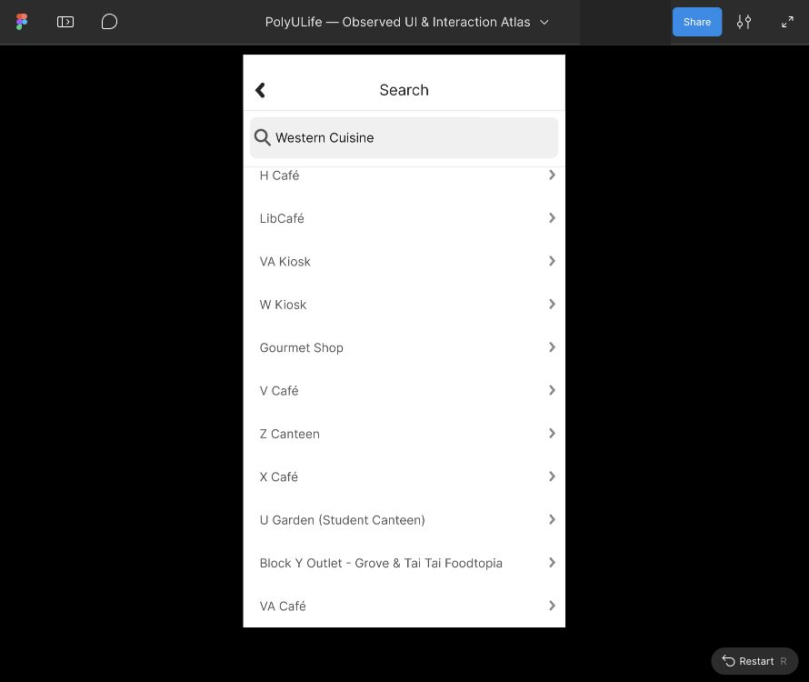

# Western Cuisine 11条结果滚动复现

本批继续处理[余下标签的原生证据与导入](food-oct3-remaining-tags-walkthrough.md)，将 Western Cuisine 草稿954:59配置为独立有限滚动参考。没有新增原生动作或页面跳转连接。当前正式Figma204映射画板、436控件、19滚动区域、140次运行；其它15个导入草稿仍未映射，完整应用与视觉保真 `not_verified`。

[打开实际参考回放](https://www.figma.com/proto/ulBuuteCRdzdBsHAaiqyUr/PolyULife-%E2%80%94-Observed-UI-and-Interaction-Atlas?node-id=954-59&scaling=min-zoom&content-scaling=fixed&starting-point-node-id=954%3A59&show-proto-sidebar=1)。Flow名称为 `Reference · Western Cuisine — finite results scroll`，说明中明确固定查询、近似几何和未配置导航。首次显示比例可能为Actual size，使用Options→Fit width and height查看完整窗口。

## 原生依据与本轮实际编辑

原生稳定截图16确认11条结果：H Café、LibCafé、VA Kiosk、W Kiosk、Gourmet Shop、V Café、Z Canteen、X Café、U Garden、Block Y、VA Café；截图04记录一次较低位置，完整原生滚动边界未测定。本轮使用既有公开文字源稿，未合并结果或新增场所。

实际编辑器多选11个Result组，建立 WesternResultsContent957:19，直接读取540×840。再建立 WesternResultsViewport957:20并转换Frame，先将内容组约束设为Left/Top，再调整视口至0/200、576×824、Clip content开启，恢复内容位置18/7，尺寸保持540×840；最后将Overflow设为Vertical。Header、SearchInput与分隔线留在视口外，原始行文字位置保持。

内容底部为847，推算滚动范围23px。该数来自近似原型几何，不是原生完整范围。所有11条公开结果可见，下滚后VA Café及其行区域更完整。H Café标题954:76经可见图层菜单选中，实际Typography读取独立Text、Inter Regular22px；没有逐项验证其它文字的编辑能力。

## 失败、恢复与实际回放

首次图层Expand辅助动作后，Western根处于隐藏状态；编辑器空白、子层灰色，Appearance显示Show。这个辅助动作是疑似触发点，未独立隔离原因。显式点击Show后，原根576×1024、700/92000恢复显示。

恢复前Present按钮和直接节点链接均进入既有Room起点，保存为06/07失败截图，不计Western回放。创建独立参考起点后，实际Present进入Western；没有据此断言默认起点差异的唯一原因。初始Actual size/侧栏裁切保存为11，关闭侧栏并选择Fit width and height后，执行顶部→下滚→额外下滚→反向顶部→额外上滚→重复下滚→重复顶部。

五项原始应用裁片267/60/623/691比较全部相等；六项Header/Search裁片267/60/623/183比较全部相等。它们证明这些保存的有限原型样本重复一致，不证明原生视觉保真、完整搜索索引或真人体验。

- [21张实际截图清单](../../evidence/2026-10-03-western-scroll/manifest.json)
- [失败、约束、文字、起点及像素检查](../../evidence/2026-10-03-western-scroll/readback.json)
- [反映实际UI编辑的源稿与布局](../../design/polyulife/food-oct3-western-scroll-layout.json)
- [剩余标签连接计划](../../design/polyulife/food-oct3-remaining-tags-plan.json)
- [覆盖台账](coverage.json)

原始导入SVG保持不变；新SVG由[生成器](../../design/scripts/build_food_oct3_western_scroll.py)记录实际分组/视口编辑，不是Figma导出，也不会执行UI操作。Back、Block Y标签调用者、结果详情和任意查询未配置。独立参考起点、布局和Overflow操作没有重试此前被拒绝的Action下拉框，也没有实现被拒绝的页面跳转连接。公开截图遮盖协作者身份；原始截图本地保留且被Git忽略。
