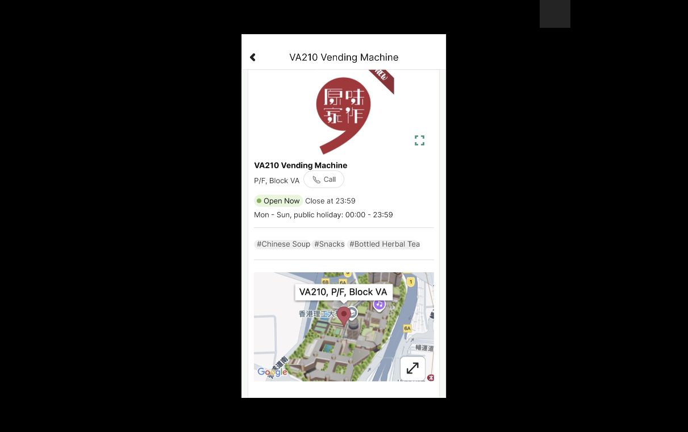

# Notification Search 原型与实际回放

2026-10-03新增5个576×1024可编辑画板、19个配置控件及4组实际Present回放。当前Figma201映射画板、436控件、136次运行；原生仍22次会话、181状态、351动作（263 observed、81 not_attempted、7 attempted_unverified），完整应用与视觉保真`not_verified`。

本批使用已经归档的[原生Search样本](notification-search-walkthrough.md)，没有把Figma回放计作新增原生执行。用户解锁后，本次Computer Use再次取得真实PolyULife窗口截图，证明连接可观察。课程真人评价和手机触控结论另行验证。

## 画板与来源

| 画板 | 实际Figma节点 | 原生截图依据 |
| --- | --- | --- |
| 空Search，已读Notification调用者 | [920:19](https://www.figma.com/design/ulBuuteCRdzdBsHAaiqyUr/?node-id=920-19) | E-NOTICE-SEARCH-02/27 |
| workshop → VA210场所结果 | [920:36](https://www.figma.com/design/ulBuuteCRdzdBsHAaiqyUr/?node-id=920-36) | 09/14/21 |
| zzhci2026 → No record found | [920:61](https://www.figma.com/design/ulBuuteCRdzdBsHAaiqyUr/?node-id=920-61) | 18 |
| Upcoming IT Workshops → No record found | [920:95](https://www.figma.com/design/ulBuuteCRdzdBsHAaiqyUr/?node-id=920-95) | 23 |
| VA210详情，返回workshop上下文 | [920:129](https://www.figma.com/design/ulBuuteCRdzdBsHAaiqyUr/?node-id=920-129) | 12 |

画板位于Observed UI页面Y84000、X0/700/1400/2100/2800。空Search和详情使用明确的调用者变体；既有970px调用者保留。标题、查询、结果、返回、文案和轮廓可编辑；插图与地图为公开原生裁片，地图署名保留，地理文字及标记仍是栅格。光标/光晕、底部圆角捕获形状未重建，其来源未知。[来源和裁切](../../design/polyulife/notification-search-sources.json)、[连接读回](../../design/polyulife/notification-search-connections.json)记录哈希、实际节点、输入差异与素材重传。

## 有限控件与输入差异

已读通知节点865:65的实际Search图层865:73连接空Search。Present中W选择workshop、Z选择zzhci2026、T选择通知标题；这些是固定查询代理，不能输入任意词，也不是原生键盘绑定。原生普通输入有依据，Return提交仍attempted_unverified，本批没有建立Enter成功语义。

19个控件全部有实际回放样本，其中10个连接使用原生已观察的状态关系，9个属于推广：

| 控件类别 | 数量 | 依据与限制 |
| --- | --- | --- |
| 通知Search入口 | 1 | 已读列表→空Search，退出后重入仍为空 |
| 查询代理 | 9 | 空页W/Z、workshop页T有相应原生输入关系；其余6个起点替换为推广 |
| 查询X清空 | 3 | workshop和负面词有原生依据；标题清空为推广 |
| Search Back | 4 | 空页和标题页有原生依据；workshop/负面词出口为推广 |
| 场所结果打开 | 1 | workshop→VA210详情 |
| 详情Back | 1 | 回到保留workshop和结果的Search |

SearchInput本身没有任意输入实现。详情Call、图片展开、地图展开/平移和标签等本批未配置；不能因为旧Food上下文曾有类似控件就宣称本调用者已覆盖。

## 实际回放及保留的失败

[公开清单](../../evidence/2026-10-03-notification-search-prototype/manifest.json)包含41张Present、6张编辑器截图与一张联系表，共48个PNG。每步实际执行后读取新状态并保存SDK截图；起点为已读Notification，应用裁片[425,60,785,700]。本地SVG渲染只用于素材检查，没有作为Present证据。

- 第一组00–12：通知→空Search→workshop→有图VA210详情→原查询→清空→负面词空结果→清空→workshop→通知标题空结果→已读通知→空Search重入→返回。
- 第二组13–27：逐条回放推广的跨查询替换、workshop/负面词退出与标题清空。
- 第三组28–33：再次进入详情时30的插图及地图都缺失；文字和返回仍可用，31回workshop，32清空，33回通知。失败保留。
- 第四组34–40：通过图片填充面板重传同一公开素材到插图920:135、地图920:162；36和38两次详情样本恢复两图，随后返回workshop和通知。

30项重复原型裁片比较29相等、1不等；不等项为03/30详情缺图区域。03/36及36/38裁片相等，支持有限恢复样本，不证明长期图片稳定性或原生保真。首次回放工具预览09曾显示黑色正文，SDK保存图实际有No record found与装饰波形；部分图像展示也出现黑色预览，以保存文件及像素比较为证，原因未隔离。32清空后URL仍短暂是workshop，保存像素为空Search，不把滞后URL当作可见结果。

编辑器额外截图期间出现网络变化，保留已保存记录后使用同一浏览器的新标签恢复；没有改系统网络设置。九个键盘触发均在编辑器读回Key(W/Z/T)。参考流程791:177的描述更新为47有限画板/83控件，并重新打开核对完全一致，写明查询代理、缺图和推广边界。

## 下一步

搜索索引范围假设仍待验证：从通知来源进入的通用Search返回场所，当前通知标题却无记录，不能据此认定产品错误。补查其它已知词和调用者、Search详情未配置控件及图片稳定性，再用真机/真实参与者验证搜索范围预期。结构、哈希和引用校验不证明完整交互覆盖。
