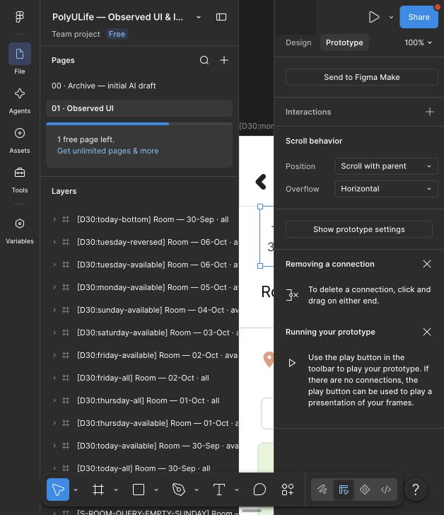
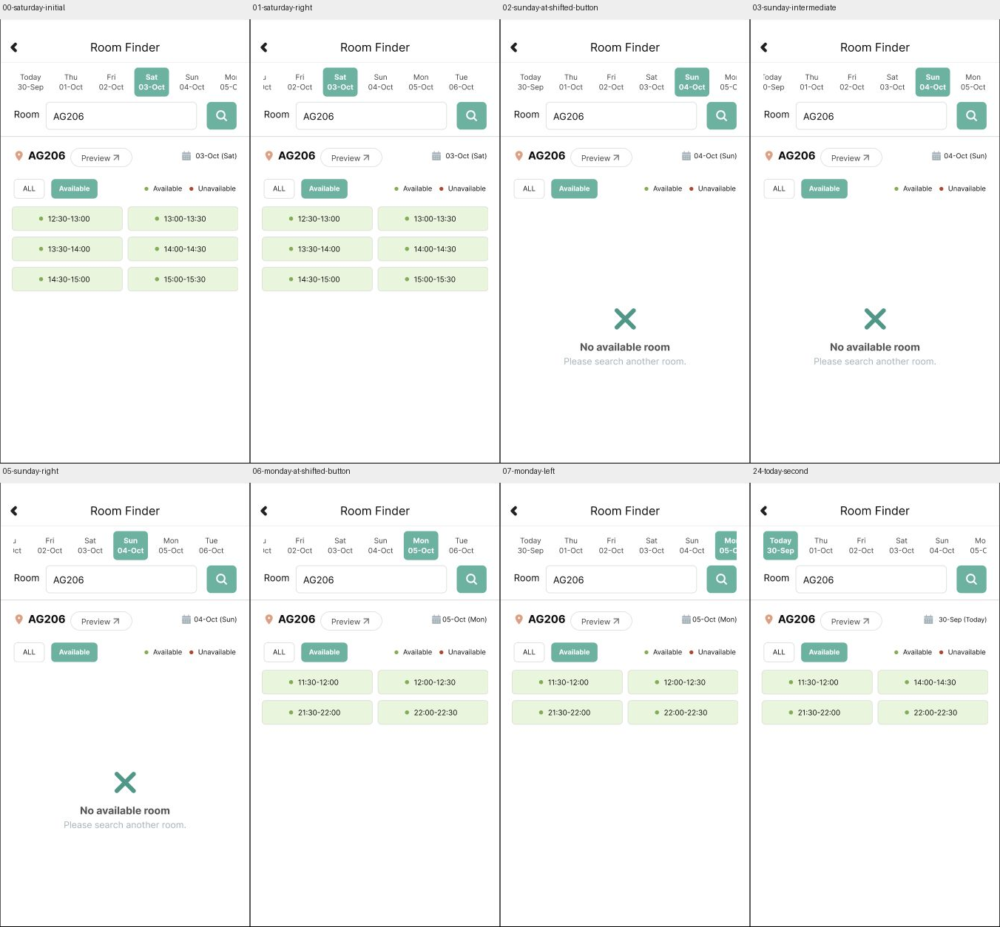

# Room：Saturday、Sunday、Monday 连续日期条

2026-09-30，通过 Computer Use 将已有三张日期画板的静态裁切组改为真正的横向滚动容器，并重建其下一日期连接。来源是[七日原生观察](room-dates-20260930.md)的 E-ROOM-DATES-08、09、10，另以原生 E-ROOM-DATES-12 支持日期条移动时结果保持的已观察行为。本批是 Figma 回放，没有新增原生日期手势实测或真人评价。

[Saturday 样例入口](https://www.figma.com/proto/ulBuuteCRdzdBsHAaiqyUr/?node-id=412-827&starting-point-node-id=412%3A827&scaling=scale-down&content-scaling=fixed&show-proto-sidebar=0) · [实际节点和连接](../../design/polyulife/room-date-context-connections.json) · [来源与准备状态](../../design/polyulife/room-date-context-strip-sources.json) · [公开截图和比较](../../evidence/2026-09-30-room-date-contexts/manifest.json)

## 当前配置

| 日期 | 已有根画板 | 新日期视口／内容 | 下一日期按钮 | 进入偏移 |
| --- | --- | --- | --- | --- |
| Saturday Available | 412:827 | 439:19／439:21 | Sunday439:38→412:936 | 0 |
| Sunday Available | 412:936 | 440:19／440:21 | Monday440:42→412:1019 | 0 |
| Monday Available | 412:1019 | 441:19／441:21 | Tuesday441:46→412:1120 | 142 |

三个视口均在 (30,100)，尺寸516×84、Clip content、Horizontal；素材整体宽658，其中日期内容组宽640、高67，白色背景延伸至658。子内容用Left/Top约束。Monday内容及容器尺寸在编辑器中另行读回，避免仅由源码推断实际图层尺寸。

进入动作均为 After delay1ms → Scroll to内容组、Instant、Y offset0，X offset见表。这是Figma显示初始化，不是原生输入动作或时延；142px范围来自复现几何，未验证原生精确范围、弹性或所有日期的手势。

旧 `C-ROOM-DATES-07/08/09` 随原日期裁切组移除；保留其配置和旧运行历史，新控制对应相同的已观察日期转换。没有新增完整根画板。已准备其余六个日期/筛选上下文的完整条和参考SVG，但状态为 `prepared_not_imported`；素材存在不算Figma实现。

## 实际回放与范围

25张Present截图、4张编辑器截图及1张拼图已脱敏归档。本次所有25张截图URL与目标节点吻合。

第一条路径：Saturday右滚后，在当前可见的Sunday(646,145)点击→Sunday空态；小滚轮步形成稳定中间位置，右滚后点击当前Monday(700,145)→Monday四段；日期条左滚/右滚保持05-Oct结果→Tuesday→回拖→Today四段。

第二条从Today继续回归既有入口：Thursday Available→ALL→Friday ALL→Available→Saturday，验证原有Friday入口和Saturday初始化，再进行小幅滚动与反向恢复。左端Sunday(730,145)→左端Monday(782,145)→Tuesday→Today均成功。

这直接验证本批滚动容器在已测位置的按钮命中，解决了[上批回放](room-horizontal-dates-prototype-walkthrough.md)中对应位置样例的失败。但旧版本失败原因没有确立；不把原型失败归为原生缺陷，也不保证任意位置和其它上下文都已通过。

12项裁片比较均相等，涵盖滚动前后的结果区、Saturday从Friday重入与反向恢复、Sunday稳定中间位置和重入、Monday双向结果保持与重入，以及两次Today返回。结果区范围(470,219,808,661)，App范围(470,60,808,661)；仅比较原型之间，不证明原生逐像素保真。

制作时曾误触日期组可见性，以及在多选日期按钮时配置连接；读取新状态后恢复可见性并移除多选连接，再选单一Tuesday按钮重建。最终记录只列已读回和回放的配置，制作尝试不计为原生动作。原型运行仍为partial，字体图标/渲染几何及完整输入、日期组合、调用来源未完成。

## 原生连接与后续

本轮同一原生句柄两次AX读取超时；应用清单仍显示PolyULife运行。单独截图也返回AppleEvent超时，bundle定位得到安装副本和相同运行副本的歧义，未取得新页面内容。台账记录 `B-POLYU-NATIVE-TIMEOUT-20260930`，原因未知，不据超时重启或清空应用。Figma工作继续，原生交接观察仍待恢复。

当前108个映射画板、244个配置控件、39次运行、3个画板内组件状态，10个滚动区域（5垂直、5水平）；原生仍132状态/268动作（185 observed、83 not_attempted）。七份公开清单合计970个PNG文件，图片数量不是覆盖率。

下一步完成其余六张已准备的连续日期栏及对应控件，接入有匹配来源证据的Home、查询、Preview、地图和返回路径；继续每个模块尚未执行的原生交互。全应用完成状态保持 `not_verified`。
