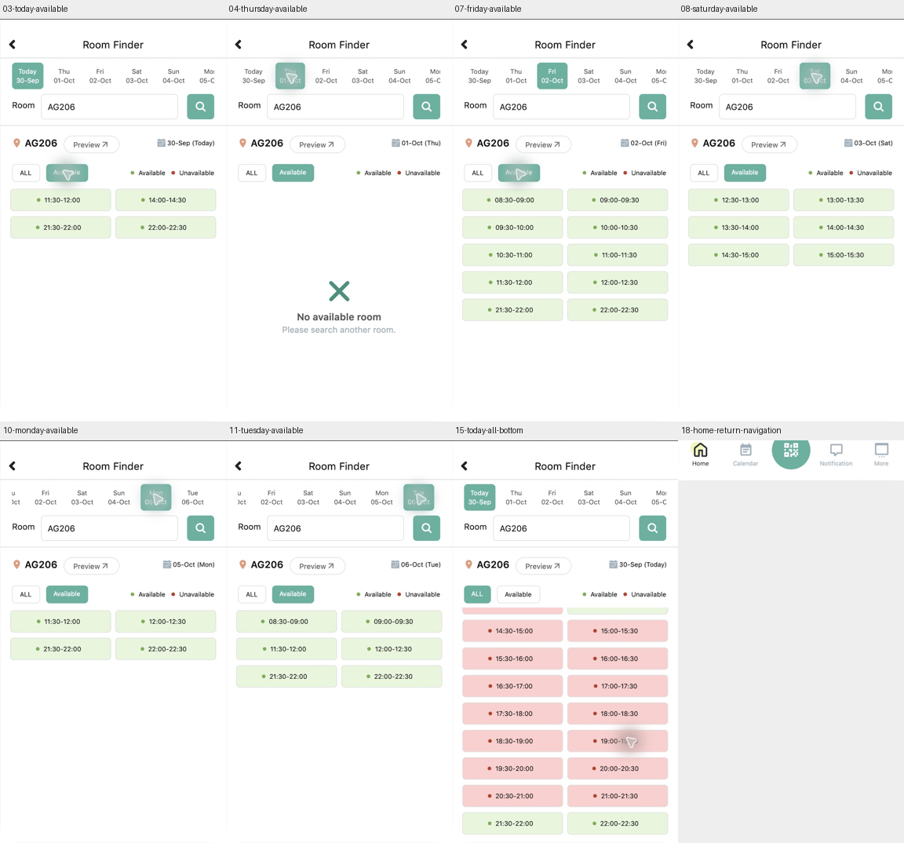

# Room：七日选择、筛选保持与列表边界

2026-09-30，使用已安装PolyULife及Mac Computer Use（本轮Home AX看到3.0.0；保存的逐步AX差分未包含版本行，不作为已归档的版本复验），保留现有登录状态。从Home进入Room，输入AG206并选择联想，随后完成下表路径。没有预约、设置变更、凭证输入或真人测试。截图原图及AX在Git忽略目录；公开Home证据仅含底部导航。

原生截图起初只有倾斜缩略图。点击AX中的full screen button后得到正常全屏画面，再按 `ctrl+super+f` 退出全屏，恢复576×1082的正常窗口截图。Room应用内容从y56开始，为576×1026；与历史112px裁切/576×970不同，不套用旧窗口坐标。全屏切换恢复了本次截图，不确定此前缩略图的根因；这是已观察到的本机恢复办法，不保证其它机器适用。

| 步骤与公开截图 | 实际动作与反馈 |
| --- | --- |
| 00–03 | Home Room→空查询（Today30-Sep）→AX setValue AG206→点击可见联想→Today ALL→Available。Today可用11:30–12:00、14:00–14:30、21:30–22:00、22:00–22:30 |
| 04–05 | 选择Thu01-Oct，Available保持，稳定后No available room；点击ALL保留Thu并显示已观察的不可用时段。曾短暂看到新日期选中、旧Today结果尚在；没有保存该瞬间或测量时延 |
| 06–07 | 在ALL中选择Fri02-Oct，ALL保持；再点Available。筛选后可用08:30–12:30各半小时及21:30–22:30两段 |
| 08 | 选择Sat03-Oct，Available保持；可用12:30–15:30六段 |
| 09 | 选择Sun04-Oct，Available保持；No available room |
| 10 | 选择Mon05-Oct，Available保持；四段11:30–12:30、21:30–22:30，日期条自动位移并显示Tue06-Oct |
| 11 | 选择Tue06-Oct，Available保持；可用08:30–09:30、11:30–12:30、21:30–22:30共六段 |
| 12–14 | 日期条向右拖动，Today重新可见，当前Tue06-Oct选择变成屏外但结果日期和Available仍为Tue；点Today恢复四段；再点ALL保持Today |
| 15–17 | 下滚Today ALL到完整末行21:30–22:00／22:00–22:30；进一步下滚无可见行进展；上滚恢复08:30顶部。只确认当前日期/窗口下的边界样例，不推广其它日期 |
| 18 | Room Back返回Home；公开图仅保留导航，身份和日程不公开 |

[19张脱敏截图与哈希、裁切尺寸](../../evidence/2026-09-30-room-dates/manifest.json) · [机器可读动作顺序](room-dates-20260930.json)

观察事实：切换日期保留已有ALL／Available筛选；拖动日期条不改变当前选择和结果。结果标题仍显示当前日期，即使选中的日期按钮已滚到屏外。列表继续下滚后的可见时段不变，但含光标的裁片像素比较不完全相同；反向列表截图也有光标附近差异，保留结果，不主张全屏像素一致。

HCI假设：新日期按钮先选中、旧结果稍后更新，可能让用户在短暂过渡中误读结果所属日期；与既有日期异步反馈候选问题一致。本次未测时延或真人影响，不重复制造新的缺陷计数。日期条滚动后选择不可见时，结果日期文字提供补充上下文；其是否足够明显需真人验证。

Figma应保留不同日期、筛选和滚动状态及新的视口尺寸，不用历史29-Sep固定数据代替30-Sep。原生取证归档时，新增状态尚未完成Figma映射，当时正式Figma为96画板／228连接／36次运行。随后[七日原型回放](room-dates-prototype-walkthrough.md)已导入12张变体并验证12个控件及Today连续列表；当前为108画板／240控件／37次运行，连续日期条和完整来源/返回仍待完成。所有日期与两个筛选的完整组合、其它房间、加载/错误网络状态、日期窗口随时间推进、其余列表/Preview/地图交接仍未全部覆盖；完整应用保持 `not_verified`。
