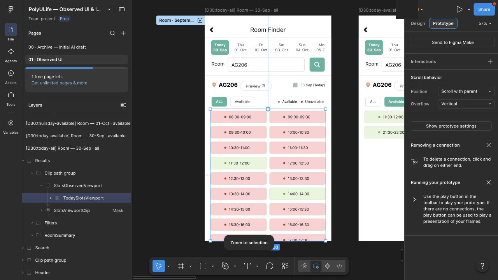
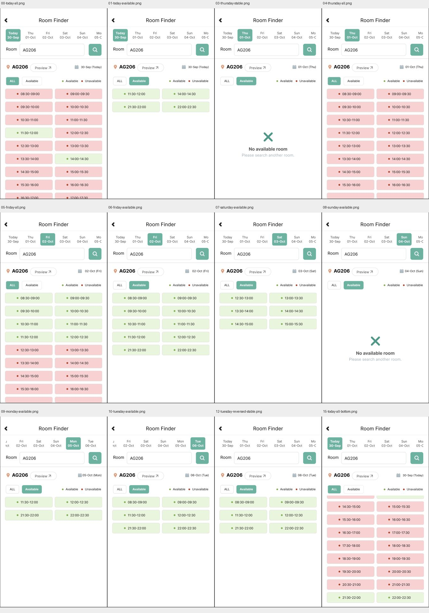

# Room：September30 日期、筛选与连续列表原型

2026-09-30，在现有 Figma 文件的 `01 · Observed UI` 页面，通过 Computer Use 导入12张可编辑 SVG、配置12个控件及1个垂直滚动区域，并在 Present 中按原生实测顺序回放。来源为[七日原生观察](room-dates-20260930.md)；本页是原型回放，不增加原生执行记录，也不替代手机或真人评价。旧日期画板和失败记录保留。

[打开本批流程](https://www.figma.com/proto/ulBuuteCRdzdBsHAaiqyUr/PolyULife-%E2%80%94-Observed-UI-and-Interaction-Atlas?node-id=412-19&scaling=scale-down&content-scaling=fixed&starting-point-node-id=412%3A19&show-proto-sidebar=1) · [源码与来源哈希](../../design/polyulife/room-dates-sources.json) · [实际节点、控件及视口配置](../../design/polyulife/room-dates-connections.json) · [截图、像素检查及脱敏清单](../../evidence/2026-09-30-room-dates-prototype/manifest.json)

## 导入画板

所有根画板的576×1026尺寸在UI中读取。标题、日期、筛选、时段和图标由Text/Vector/Group组成；字体、图标与颜色近似，未验证每个子图层编辑或逐像素原生一致。

| 日期与筛选上下文 | 节点 | 原生来源 | 回放 |
| --- | --- | --- | --- |
| Today ALL | 412:19 | E-ROOM-DATES-02、15 | 起点、恢复及连续列表 |
| Today Available | 412:216 | E-ROOM-DATES-03 | 四段与重返 |
| Thursday Available | 412:317 | E-ROOM-DATES-04 | 无可用房间 |
| Thursday ALL | 412:400 | E-ROOM-DATES-05 | 仅已观察视口 |
| Friday ALL | 412:551 | E-ROOM-DATES-06 | 仅已观察视口 |
| Friday Available | 412:702 | E-ROOM-DATES-07 | 十段 |
| Saturday Available | 412:827 | E-ROOM-DATES-08 | 六段 |
| Sunday Available | 412:936 | E-ROOM-DATES-09 | 无可用房间 |
| Monday Available | 412:1019 | E-ROOM-DATES-10 | 四段、日期条位移 |
| Tuesday Available | 412:1120 | E-ROOM-DATES-11 | 六段、日期条位移 |
| Tuesday，日期条回拖 | 412:1229 | E-ROOM-DATES-12 | 日期按钮回到左侧、结果仍06-Oct |
| Today ALL末端独立参考 | 412:1338 | E-ROOM-DATES-15 | 已导入，未接线或独立Present运行；实际末端由412:19滚动到达 |

## 实际路径与差异

Today ALL→Available→Thursday Available→ALL→Friday ALL→Available→Saturday→Sunday→Monday→Tuesday→日期条向右拖动→Today→ALL。11个点击连接均为Navigate to固定画板，日期选择保留了实测的筛选；并未实现任意日期/筛选组合或实时可用性。自动生成的重复Flow3已移除；保留命名流程 `Room · September30 dates and filters`。

Tuesday日期条回拖连接为On drag→412:1229，Figma自动选择Smart animate、300ms、Ease out。这是原型展示参数，不是原生时延测量。触发器接受任意方向的拖动，并只切到固定回拖截图结构，**不支持连续横向滚动或任意停留位置**。新原型目前独立从Room起点进入，没有Home返回、查询输入、Preview或地图交接；这些交互仍需与正确来源上下文连接。

首次Thursday点击后，02裁片的URL读取仍是412:216；随后没有再次点击，03稳定截图及URL已确认412:317。保存这个过早取样与后续确认，不把它推断为原生缺陷或原型导航失败。回放记录见 `PROTO-ROOM-DATES-001`；共有18张Present裁片和1张编辑器证据。

## Today ALL 连续滚动

在412:19内将列表内容包入 `TodaySlotsViewport`（419:31），位置(26,426)，524×600，Clip content开启，Overflow=Vertical，子内容约束Left/Top。28个已观察半小时时段08:30–22:30由本轮顶部/底部证据拼合；内容高996，396px范围由复现几何推导，不是原生偏移量测量。

曾在视口缩小时看到内容一起压缩，随后恢复原尺寸，将子内容约束改为Left/Top，再缩小视口。最终实际回放保留55px行高和70px行距。下滚到完整21:30–22:00/22:00–22:30末行、再次下滚及反向恢复08:30均已记录。边界结论只针对September30 AG206 Today ALL和这个Mac窗口，不推广到Thursday/Friday或其它房间。

6项原型裁片比较中4项相等：Today ALL恢复、反向顶部恢复、列表末端复查、Today Available恢复。Tuesday回拖前后两项不同，差异均位于相应裁片的顶部右侧小区域；未确立原因，记录原始范围，不主张全幅像素相等。可见结果日期、筛选和六段文字一致；完整原生/Figma视觉保真仍待验证。

## 当前范围

正式Figma共108映射画板、240控件、37次运行（包含历史失败），另有3个画板内组件状态和6个滚动区域。原生仍132状态/268动作（185 observed、83 not_attempted）；这次没有新原生会话或业务动作。

全应用保持 `not_verified`。下一步补连续日期条、Home及查询/Preview/地图来源和返回、剩余日期/筛选组合，再继续原生尚未尝试的控件。独立末端参考画板存在不代表新增通过路径；结构验证、像素回归和本条样例均不能证明Room或完整应用完成。
