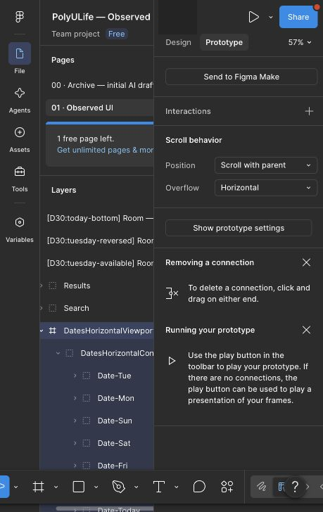
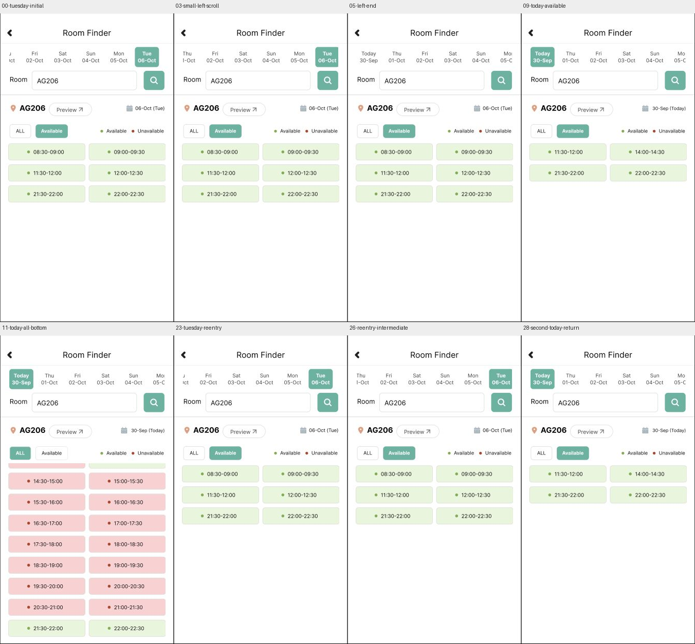

# Room：Tuesday 连续日期条与 Today 返回

2026-09-30，通过 Computer Use 将 Tuesday 画板中的有限拖动跳转替换为真正的横向滚动区域，连接新日期条的 Today 点击，并完成原型回放。本批没有新增原生观察或真人评价。原生来源为[七日选择记录](room-dates-20260930.md)的 E-ROOM-DATES-11、12、13。

[Monday 起点样例](https://www.figma.com/proto/ulBuuteCRdzdBsHAaiqyUr/?node-id=412-1019&starting-point-node-id=412%3A1019&scaling=scale-down&content-scaling=fixed&show-proto-sidebar=0) · [实际连接和素材哈希](../../design/polyulife/room-horizontal-dates-connections.json) · [公开截图与比较清单](../../evidence/2026-09-30-room-horizontal-dates/manifest.json)

## 当前配置与旧记录

Tuesday 根画板仍为 `412:1120`，576×1026；日期条视口 `436:32` 位于 (30,100)，516×84、Clip content、Horizontal，内容组 `436:34` 宽658。子内容使用 Left/Top 约束，142px 滚动范围来自复现几何，未测量原生精确偏移或边界。

入口初始化为 After delay 1ms → Scroll to DatesHorizontalContent、X offset142、Y offset0、Instant。这是 Figma 内部定位手段，不是原生动作或延迟。新 Today 控件 `436:35` 用 On click → Navigate to `412:216`（Today Available）。

旧日期组和 `C-ROOM-DATES-12` 有限 On drag 跳转已移除，原配置转存覆盖台账的 `superseded_action_connection_mappings`；旧回放保持历史内容。`412:1229` 仍是旧反向位置参考画板，其原 Today 连接保留，但新路径通过同一个 Tuesday 画板的真实滚动到达反向位置。完整横向 SVG 是来源参考，仅日期条素材被导入现有画板，没有新增完整画板。

## 实际回放结果

共27张 Present 截图、2张编辑器配置截图和1张拼图。右拖40屏幕像素和水平右滚0.1页都没有建立稳定中间位置；随后左滚0.01页得到不同中间位置，无输入复查保持该位置。滚至左端后 Today 可见、Tuesday 按钮移出视口，但结果仍为06-Oct Available六段；继续左滚位置不变。反向拖动使 Tuesday 再次可见，截图与初始位置并不完全相等，不据此主张精确恢复了右端边界。

点击新 Today 后切换为30-Sep Available四段；已有 ALL 切换、垂直滚至完整末行和反向回到顶部均跑通。再经已有日期/筛选链进入 Monday→Tuesday，初始化恢复首次进入的位置，并再次完成中间位置→左端→Today 返回。

| 核对项 | 当前证据 |
| --- | --- |
| Tuesday 连续中间位置与保持 | 03、04；重入后26 |
| 左端及继续滚动不变 | 05、06；第二次27 |
| 日期条滚动保持结果区 | 00 对03、05、27及23对26，结果区像素相等 |
| Tuesday 重入恢复初始位置 | 00 对23，全 App 裁片像素相等 |
| Today 返回两次一致 | 09 对28，全 App 裁片像素相等 |
| Today ALL 列表反向恢复 | 10 对12，全 App 裁片像素相等 |

10项裁片比较中9项相等；00与07全 App 裁片不等，差异局限在日期条区域。保留差异范围，不能据此推断原生问题或完整视觉一致。结果区比较范围为 (470,219,808,661)，App范围为 (470,60,808,661)；这些都是原型相互比较，不是原生逐像素保真验证。

回归其它静态日期条时，19点击Sunday和21点击Monday各有一次没有导航；随后的截图显示日期条位于不同位置，重新定位后20、22成功。没有把失败改写为通过，也没有确定原因。`PROTO-ROOM-HORIZONTAL-DATES-001` 因仍有这些问题和完整范围缺口，状态保持 partial。原生记录使用拖动，本批另用滚轮观察连续位置，属于原型输入差异。

## 未完成范围

正式台账当前108个映射画板、241个配置控件、38次运行，另有3个画板内组件状态及7个滚动区域（5垂直、2水平）。原生仍132状态/268动作（185 observed、83 not_attempted）。

连续日期条仅实现Tuesday上下文，其它日期栏仍是静态素材；其它筛选/日期组合、Home和查询/Preview/地图交接、日期栏命中差异、完整字体图标颜色保真及手机/真人评价仍待完成。日期与可用性固定为已观察历史数据，不是实时查询。全应用范围仍为 `not_verified`。
