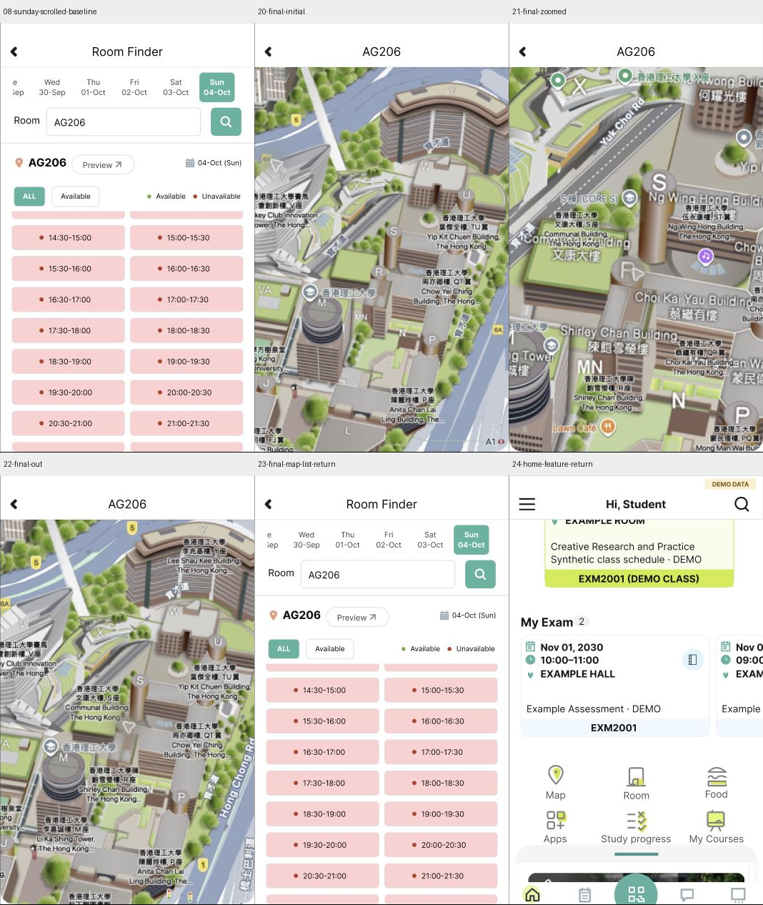

# AG206 地图样例回放

2026-09-30，通过浏览器 Computer Use 回放当前Figma文件的 `01 · Observed UI` 页面。起点为Tuesday Home `67:694` 的DEMO资料，进入Room既有A联想样例、AG206、Available、Sunday空结果、ALL，再下滚列表并打开Location。来源为[原生Room走查](room-walkthrough.md)及[9月29日补查](room-recheck-20260929.md)；本次没有新增原生执行或真人评估。

三个地图画板使用可编辑标题和Back、公开截图裁出的地理底图。地图标记、标签、光标与光晕仍在栅格中；这是观察状态的部分复现，不能满足完整可编辑地图、实时地图或全部地图交互。

| 控件/节点 | 实际配置与回放 | 原生依据与边界 |
| --- | --- | --- |
| Sunday ALL Location `327:251` | Open overlay→初始地图 `338:19` | A-ROOM-MAP-PIN；从下滚列表进入 |
| 初始地图 `338:19` | ↑ Swap overlay→放大 `339:30` | A-ROOM-MAP-INCREMENT原生使用AX Slider Increment；↑只是输入代理 |
| 放大地图 `339:30` | ↓ Swap overlay→缩小 `339:41` | A-ROOM-MAP-DECREMENT原生使用AX Slider Decrement；↓只是输入代理 |
| 缩小Back `339:47` | Close overlay→原Sunday ALL下滚位置 | A-ROOM-MAP-BACK；补查E10确认原生路径保留日期、ALL和列表位置 |
| 初始Back `338:25` | Close overlay→原下滚列表 | 原型推断出口，action_id null；没有增加原生成功执行 |
| 放大Back `339:36` | Close overlay→原下滚列表 | 原型推断出口，action_id null |

首次运行记录00–14：地图初始→↑→↓→Back成功，返回列表与基线08逐像素相等；再次打开初始地图出现白色底图，截图13保留。初始Back仍能恢复列表。未把这次缺图归为PolyULife问题，未声称第一次视觉通过。

通过Figma图片填充的Upload from computer重新上传同一 `room-map-initial-geography.png` 至 `338:22`，读回576×870和图片填充。首次用键盘激活上传按钮未触发file chooser，随后实际点击按钮成功上传。原始素材哈希和裁切来源保持不变；Figma读回的图像色彩管理属性变化已记录，原因和其对像素差异的影响未确定。

复验记录15–24：初始地图三次重入均可见；初始Back、放大Back及完整↑→↓→Back均恢复下滚列表，最后Room Back恢复Tuesday Home原功能区位置。六个地图控件均实际回放。11个原型裁片像素检查中8个相等、3个不同：五次列表返回和Home返回全部相等；部分地图重入之间的差异局限于底图区域，未确定原因，不主张像素一致。

[25张截图、哈希及11个像素检查](../../evidence/2026-09-30-room-map-replay/manifest.json)仅裁出356×601的应用原型区域，排除Figma账户区。历史[未完成检查点](room-map-work-in-progress.md)和失败尝试保留。已归入 [coverage.json](coverage.json) 的三个Frame、六个控件、首次失败运行和修复后复验分别记录；S-MAPRETURN复用Sunday ALL `327:202`，不新增重复全屏画板。

尚未实现自由平移、真实缩放滑杆、缩放边界、可编辑地理标签、Google Maps交接、全部入口/设备/数据上下文及完整视觉保真。原生A-ROOM-MAP-DRAG没有建立成功平移，不用本原型的静态地图推断原生能力。Sunday日期转换800ms来自既有演示配置，并非原生网络时延。Home和Room仍有未完成交互；全应用完成状态保持 `not_verified`。
