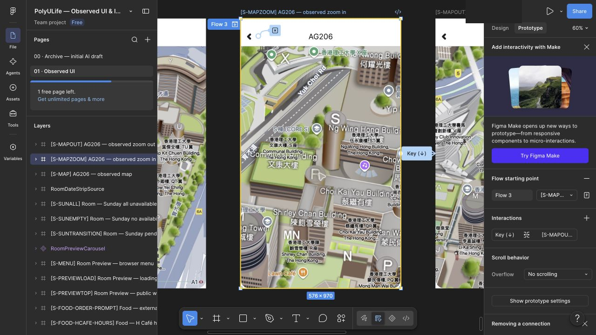

# AG206 地图复现检查点（尚未回放）

2026-09-29。三个地图 Frame 已导入 Figma；本批仍是 **work in progress**，未计入 `coverage.json` 的正式映射和原型运行统计。完整应用仍为 `not_verified`。本批没有新增原生观察或真人评估。

## 依据与实现

| 原生状态 / 证据 | Figma 节点 | 源码 |
| --- | --- | --- |
| S-MAP / E-MAP | [338:19](https://www.figma.com/design/ulBuuteCRdzdBsHAaiqyUr/?node-id=338-19) | [initial](../../design/polyulife/room-map-initial.svg) |
| S-MAPZOOM / E-MAPZOOM | [339:30](https://www.figma.com/design/ulBuuteCRdzdBsHAaiqyUr/?node-id=339-30) | [zoomed](../../design/polyulife/room-map-zoomed.svg) |
| S-MAPOUT / E-MAPOUT | [339:41](https://www.figma.com/design/ulBuuteCRdzdBsHAaiqyUr/?node-id=339-41) | [out](../../design/polyulife/room-map-out.svg) |

每个画板576×970，Y=36000，X依次0/700/1400。标题与Back为可编辑图层，底图从公开原生截图裁取(0,100,576,970)，保留原截图中的光标与光晕，不补造被遮像素。地图地理、标签及标记仍为栅格图片，不是实时地图。

已配置：339:47（缩小画面的Back）Close overlay，对应A-ROOM-MAP-BACK；339:36（放大画面的Back）Close overlay，为原型推断；339:30的Key(↓) Swap overlay至339:41，对应A-ROOM-MAP-DECREMENT的结果。最后一项已在重新打开的编辑器中读回确认。↓只是原型输入代理，原生执行的是AX Slider Decrement，未观察原生方向键行为。

放大与缩小画面的图片此前已通过上传对话框重传。初始画面的额外重传尝试因点击定位与file chooser超时没有完成；SVG导入的底图在编辑器可见，仍需Present确认。浏览器出现截图/点击坐标不一致，重新打开后台标签后可以读回配置，但未完成路径回放。没有将工具异常归为App缺陷。

## 从这里继续

1. 初始338:19的Back配置Close overlay，明确为未独立原生验证的出口。
2. 初始338:19配置↑ Swap overlay到339:30，注明原生AX Increment的代理输入。
3. Sunday ALL327:202的Location打开338:19。原生入口来自S-SUNSCROLLED；原型让列表顶部也可触发属于泛化。
4. 删除339:30上自动生成的Flow 3，避免将中间状态误作正式入口。
5. 从Tuesday Home走Room → A → AG206 → Available → Sun → ALL → 下滚 → Location → ↑ → ↓ → Back → Home。补测初始/放大画面Back。
6. 截图验证底图、日期/ALL保留与Home返回。原生地图返回只证明日期和ALL，未证明列表滚动保留；原型结果单独记录。
7. 回放后将映射、连接及证据加入正式台账。不要把WIP直接视为通过，也不要重跑历史归档脚本。

自由平移、真实缩放边界、Google Maps交接均未实现；A-ROOM-MAP-DRAG没有证明成功平移。S-MAPRETURN可对应既有Sunday ALL状态，无需造重复全屏画板。

[机器可读接力记录](../../design/polyulife/room-map-work-in-progress.json) · [素材来源与哈希](../../design/polyulife/room-map-assets.json) · [生成脚本](../../design/scripts/build_room_map_svg.py) · [原生Room走查](room-walkthrough.md)
