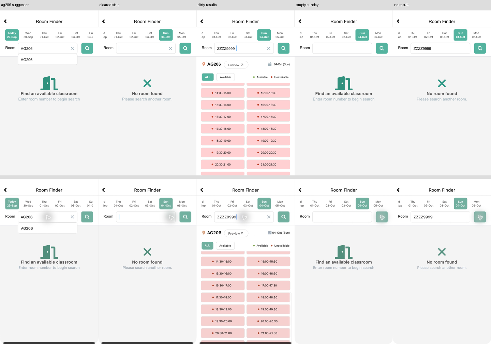

# Room 查询状态源码（尚未导入 Figma）

2026-09-30。以[9月29日原生复查](room-recheck-20260929.md)为依据，新增五个576×970可编辑SVG。当前会话未提供Computer Use工具，不能导入、连线或回放Figma；这些源码不增加正式画板/控件/原型运行数量。

| 源码 | 真实状态与证据 | 需要表达的行为 |
| --- | --- | --- |
| [AG206联想](../../design/polyulife/room-query-ag206-suggestion.svg) | S-ROOM-QUERY-AG206 / E-ROOM-RECHECK-02 | 完整房间号、一个联想项及原始提示并存 |
| [修改输入后旧结果](../../design/polyulife/room-query-dirty-results.svg) | S-ROOM-QUERY-DIRTY / E-ROOM-RECHECK-12 | ZZZZ9999与旧AG206列表并存，Sunday/ALL及已观察滚动位置保留 |
| [无匹配结果](../../design/polyulife/room-query-no-result.svg) | S-ROOM-QUERY-NONE / E-ROOM-RECHECK-13 | 点击搜索后出现No room found |
| [清空后的旧空态](../../design/polyulife/room-query-cleared-stale.svg) | S-CLEARED的Sunday上下文 / E-ROOM-RECHECK-15 | 输入为空、光标可见，No room found尚未消失 |
| [空查询恢复提示](../../design/polyulife/room-query-empty-sunday.svg) | S-EMPTYQUERY的Sunday上下文 / E-ROOM-RECHECK-16 | 再次搜索后恢复初始提示，Sunday仍选中 |

本批保留9月29日实际日期条：Today29-Sep、Wed30-Sep至Mon05-Oct。不会把历史9月28日原型的日期含义覆盖掉；导入时须用清楚的日期/上下文别名。后两张复用已有原生状态ID，不制造新的观察计数。

源码保留独立Header、SearchButton、ClearInput、AG206Suggestion、NoRoomFound等图层，便于连接。dirty-results列表是固定已观察偏移，不提供连续滚动或实时可用性。输入目前是静态文本，尚未实现任意字符串或真实键盘；若先用演示输入代理，需在Figma说明并与原生输入方式分开。

本地使用resvg-py0.5.0渲染并逐列与截图对照：结构、日期、查询/空态区别和列表行位置已检查。字体宽度/字重、图标、滚动指示条仍有差异，未做Figma视觉验收。上排为源码渲染，下排为真实截图；光标光晕和窗口输入边缘未复制进源码。

## 接力步骤

1. 恢复Computer Use后导入五个SVG，验证Text/Vector图层、字体及尺寸，登记实际节点。
2. 配置dirty-results → 搜索 → no-result → 聚焦/清空 → cleared-stale → 搜索 → empty-sunday；不要在文字刚清空时提前切换初始提示。
3. AG206联想属于Today上下文。选择结果不能直接跳到Sunday结果；需准备对应Today状态或保留为单独待连路径。
4. 继续实现实际输入和其他查询分支；ZZZZ9999样例不代表全部异常输入覆盖。
5. 实际Present回放和视觉比较后，才更新正式覆盖台账。地图WIP另见[地图检查点](room-map-work-in-progress.md)。

[生成器](../../design/scripts/build_room_query_svg.py) · [来源、哈希及本地渲染记录](../../design/polyulife/room-query-sources.json)
