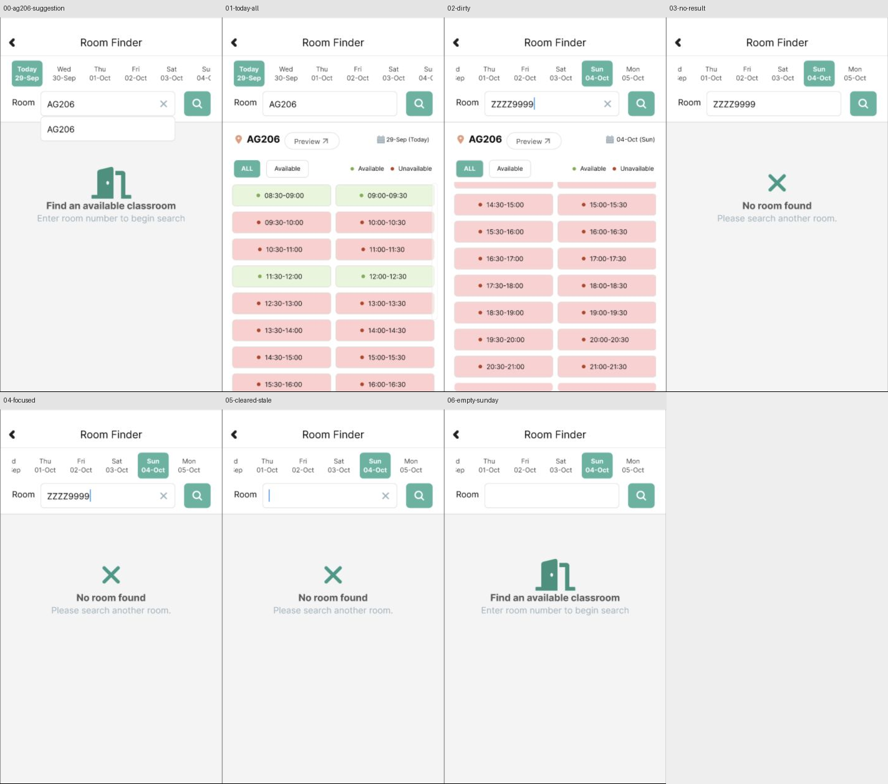

# Room 查询：9月29日样例的 Figma 回放

2026-09-30。根据[原生补查](room-recheck-20260929.md)的已脱敏截图，七个576×970可编辑画板已通过Computer Use导入[Figma文件](https://www.figma.com/design/ulBuuteCRdzdBsHAaiqyUr/)的`01 · Observed UI`页面（12:104）。这批为固定日期、房间号和结果数据的**样例回放**；并非可输入任意文字的搜索实现，也不证明完整PolyULife已覆盖。

| 可编辑源码 | 原生状态与依据 | Figma节点 | 本次回放角色 |
| --- | --- | --- | --- |
| [AG206联想](../../design/polyulife/room-query-ag206-suggestion.svg) | S-ROOM-QUERY-AG206 / E-ROOM-RECHECK-02 | 381:265 | Today 29-Sep，联想项可点 |
| [Today ALL](../../design/polyulife/room-query-today-all.svg) | S-ALL的29-Sep上下文 / E-ROOM-RECHECK-04 | 396:19 | 选择AG206后的正确日期与时段 |
| [改输入后旧结果](../../design/polyulife/room-query-dirty-results.svg) | S-ROOM-QUERY-DIRTY / E-ROOM-RECHECK-12 | 381:72 | ZZZZ9999与旧AG206 Sunday列表并存 |
| [无匹配](../../design/polyulife/room-query-no-result.svg) | S-ROOM-QUERY-NONE / E-ROOM-RECHECK-13 | 381:19 | 点击搜索后的No room found |
| [聚焦无匹配](../../design/polyulife/room-query-focused-no-result.svg) | S-ROOM-QUERY-NONE / E-ROOM-RECHECK-14 | 383:19 | 查询保持、光标出现；清空图标形状参照相邻聚焦态推断 |
| [清空后旧空态](../../design/polyulife/room-query-cleared-stale.svg) | S-CLEARED的Sunday上下文 / E-ROOM-RECHECK-15 | 381:327 | 输入为空但No room found尚未消失 |
| [空查询恢复](../../design/polyulife/room-query-empty-sunday.svg) | S-EMPTYQUERY的Sunday上下文 / E-ROOM-RECHECK-16 | 381:383 | 再次搜索后恢复提示、Sunday仍选中 |

两条独立的Figma Flow通过Present实际回放：

1. **Room · AG206 suggestion to Today ALL**：`381:265`的AG206Suggestion `381:323`点击后到`396:19`。这对应原生选择联想项的结果；E-ROOM-RECHECK-04是稳定结果截图，并非额外一次选择执行。
2. **Room · unmatched search, clear, retry**：`381:72` SearchButton `381:113`→`381:19` RoomInput `381:60`→`383:19` ClearInput `383:67`→`381:327` SearchButton `381:369`→`381:383`。四个目的节点均在Present URL和稳定画面中核对。点击输入框只是聚焦状态代理；原生E14包括一次未成功的清空定位尝试，不能宣称该点击等同原生成功动作。

此前导入的Frame及少量控件在Figma图层中处于隐藏状态，导致画布与Present看似缺页、缺搜索按钮或输入框边框。本次逐个恢复了七个Frame的显示，并在`381:72`恢复SearchButton、在`381:19`恢复RoomInput；之后重新回放了样例。操作后的稳定画面见[七张公开截图与哈希](../../evidence/2026-09-30-room-query-replay/manifest.json)。公开图仅裁出合成的Room原型画面，排除Figma账户区；浏览器原图保留在Git忽略目录。

日期条按9月29日的真实样例固定：Today29-Sep、Wed30-Sep至Mon05-Oct；不覆盖历史9月28日原型的日期含义。dirty-results列表使用固定的已观察偏移，不是连续滚动；查询文字是静态样例，不支持任意输入、等待联想或实时可用性。字体宽度/字重、图标与滚动指示条仍有差异。聚焦无匹配态的清空图标在E14中被指针遮挡，形状为相邻聚焦状态的推断。`ClearInput`之后保留旧空态，再次搜索才恢复提示；这一区别已在样例中回放。

本地resvg对最初五个源码做过逐列比对，[对照图](../../design/polyulife/assets/room-query-source-comparison.png)只包含当时的五张；聚焦无匹配和Today ALL另行渲染检查。Present截图验证本次两条**导航样例**，尚未验证全部视觉细节、自由输入、其他日期/房间、所有Back出口和完整App。

[生成器](../../design/scripts/build_room_query_svg.py) · [来源及Figma节点清单](../../design/polyulife/room-query-sources.json)

本次先提交回放检查点。上述七个画板、五条连接和两次样例运行尚待归入正式 `coverage.json` 台账；台账现有数量暂不调整，原生观察次数保持不变。
