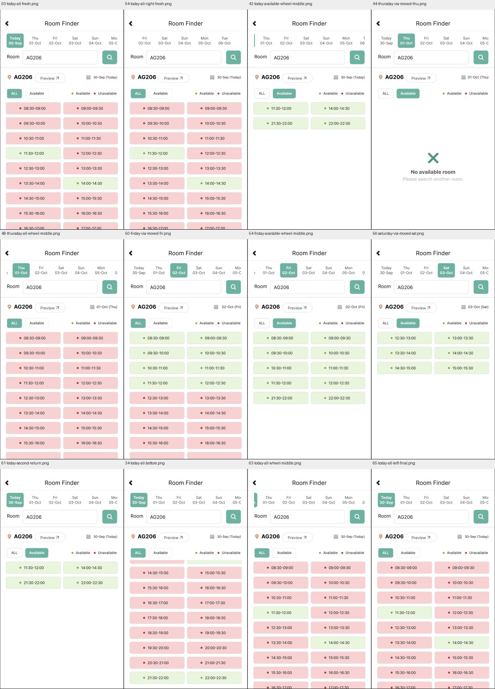

# Room 剩余六个日期栏原型回放

2026-09-30，通过 Computer Use 在实际 Figma 文件中配置并回放。依据是此前的[七日原生观察](room-dates-20260930.md)，本批不增加原生状态、动作或真人评估数据。全应用仍为 `not_verified`。

[Today ALL 回放入口](https://www.figma.com/proto/ulBuuteCRdzdBsHAaiqyUr/?node-id=412-19&starting-point-node-id=412%3A19&scaling=scale-down&content-scaling=fixed) · [实际配置与替代记录](../../design/polyulife/room-remaining-date-bars-connections.json) · [公开截图与比较清单](../../evidence/2026-09-30-room-remaining-date-bars/manifest.json)

## 当前配置

| 上下文 | 原画板 | 日期视口 | 内容层 | 重接按钮 |
| --- | --- | --- | --- | --- |
| Today ALL | `412:19` | `463:19` | `463:21` | 保留原筛选 |
| Today Available | `412:216` | `465:19` | `465:21` | Thu `465:26` → `412:317` |
| Thursday Available | `412:317` | `466:19` | `466:21` | 保留原筛选 |
| Thursday ALL | `412:400` | `467:19` | `467:21` | Fri `467:30` → `412:551` |
| Friday ALL | `412:551` | `497:51` | `497:53` | 保留原筛选 |
| Friday Available | `412:702` | `509:84` | `509:86` | Sat `509:99` → `412:827` |

六个新视口均在 (30, 100)，尺寸 516 × 84、内容宽度 658，启用 Horizontal 和 Clip content。子层先设 Left/Top 约束再缩窄视口。六个原画板配置 After delay 1ms → Scroll to DatesHorizontalContent、X/Y offset 0、Instant；该初始化是 Figma 显示处理，不代表原生 App 的动作、延迟或重入规则。142px 范围由素材几何推得，不代表原生全部滚动边界已验证。

原连接 `C-ROOM-DATES-01/04/06` 随旧日期遮罩移除，新的日期控件重建对应跳转，历史配置和运行保留。连同此前的[Tuesday](room-horizontal-dates-prototype-walkthrough.md)及[Saturday/Sunday/Monday](room-date-contexts-prototype-walkthrough.md)，十个主要日期样例上下文现均使用连续横向日期栏。两个独立反向/末端参考画板仍保留，不计为新的连续交互上下文。

## 实际回放

65 张 Present 截图的 URL 节点均与预期一致。第一条路径为 Today ALL → Available → Thu Available → ALL → Fri ALL → Available → Sat → Sun → Mon → Tue → 日期回拖 → Today Available → ALL；六个新增上下文分别抽样正向与反向拖动。第二条路径先用小幅水平滚轮移动日期，再按可见位置点击 Thu (522,145)、Fri (582,145)、Sat (637,145)，继续经 Sun/Mon/Tue 返回 Today。以上屏幕坐标仅用于本次 1280×720 Present 视口，不是可跨环境复用的定位规则。

部分反向拖动的截图显示边缘回弹；最初尝试的“中间拖动”没有建立稳定中间位置。随后六个上下文分别用 0.03 页的小幅水平滚轮形成不同位置，并以无输入的后续截图复查。滚轮是原型验证输入，不是新观察到的原生手势。结果区在日期栏移动时保持对应日期与筛选内容。

Today ALL 的原有纵向列表仍可到完整末行 22:00–22:30，再反向回到顶部。Today 两种筛选间的返回、再次进入及两次七日路径返回均有截图。Friday ALL 误替换整个画板的错误已经通过七次撤销恢复原节点，之后正确替换日期遮罩；本批又回放了原 Available 筛选和完整 Friday 页面。错误截图保留为 Figma 操作诊断，不归为原生 App 缺陷。

## 比较与证据范围

本批公开 81 张实际截图（65 张 Present、16 张配置/错误截图）及一张拼图。36 项裁片比较中 30 项像素相等；六项不等均是拖动反向返回与基线的日期区域差异，差异范围约为 App 裁片内 y51–117，未声称精确恢复边界。六个稳定中间位置与无输入复查均相等；六组移动前后结果区相等，路线返回及重入样例也相等。详见清单中的每项结果，不能把通过数量作为全应用覆盖率。

比较范围为 App (470,60,808,661) 或结果区 (470,219,808,661)，只比较原型截图之间，不证明原生逐像素保真。编辑器截图遮盖头像，内容使用公开历史 AG206 数据。最初两张回放截图来自此前中断前的记录，其时间保留；后续从新 Present 会话的 Today ALL 开始，不把中断前后视为连续运行。

## 仍待完成

当前固定为已观察的 30-Sep 至 06-Oct 历史日期及有限 AG206 结果。其它日期/筛选组合、任意查询、加载与变化反馈、Home/query/Preview/map 的完整来源栈、原生重入语义、精确视觉与手机手势体验尚未完成。其它模块的未测入口、控件及边界仍见[覆盖台账](coverage.json)。本批不解决原生 Preview 截图空白，也不代替课程真人测试。
